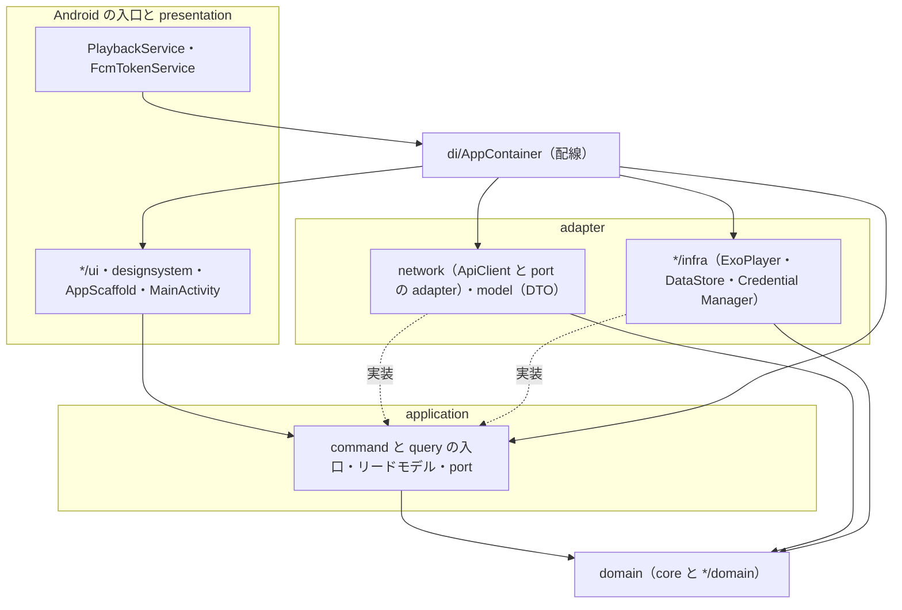
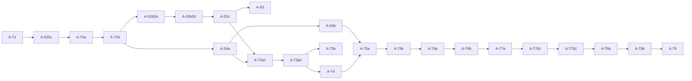

# news-listen-android Implementation Spec — 目標アーキテクチャ（全 context。design mode）

日付: 2026-09-30 ／ mode: design（実装は止めてある）／ owner: user ／ decision_maturity: proposed（この Spec を含む PR の承認で確定する）
対象の revision: android `7e400f0b`（branch `docs/2026-09-30-refactor-target-architecture`。親 plan の停止位置と同じ commit）。path は断りが無い限り `android/app/src/main/java/com/rioikeda/newslisten/` からの相対。

## 1. 前書き

### 1.1 目的

リファクタの完了時に Android のコードが満たす構造を、実在の path・型名・検査に落とす。目的は親 docs の [ADR-110](../../../docs/adr/110-refactor-target-domain-centered-onion-cqrs.md) が定める 2 点である。

1. ドメインモデル・リードモデル・データモデルが分かれ、カプセル化されている。
2. ドメインモデルを中心に置いた層構造と、command と query の分離で、変更しやすい。

層・3 つのモデル・変換の置き場・command と query・カプセル化・検査の定義は、親 docs の [architecture.md](../../../docs/design/architecture.md) に従う。本書は定義を書き直さず、Android の具体だけを書く。

### 1.2 既存の Spec との関係

| 文書 | 正本とする範囲 |
|---|---|
| 本書（2026-09-30） | module 全体の構造。層と path の対応、依存の規則、context ごとのモデルの対応・command と query・規則の置き場・port、検証、slice の全体 |
| [既存の Spec（2026-09-16）](2026-09-16-implementation-spec-playback-auth.md) | 再生・認証・テストの土台の範囲の、状態遷移と契約の詳細（遷移表 11 辺、`AuthState` の遷移表、CI-T1〜T21、CP1〜CP9） |

同じ契約を 2 つの文書に書かない。既存の Spec にある契約は ID（CI-T*・INV-P1・CP*）で参照する。構造（どの層に置くか・どの型を持つか）について両者が食い違うときは本書を正とし、既存の Spec の本文を直して改訂履歴に残す。契約の中身（遷移・事後条件）は既存の Spec が正である。

### 1.3 読む順

§3（層と path）→ §4（依存の規則）→ 触る context の §5.x → §8（slice と、既存 order の補正）→ §7（検査）。決定の一覧は §10。

### 1.4 状態

design。実装と takt への投入は止めてある（親 plan「実装の停止と再開ゲート」）。本書の「現状」は上の revision の実コードを読んで書いた。Gradle・テストは実行していない。

## 2. 要求と trace の入口

| 種類 | ID | 本書で応える節 |
|---|---|---|
| 品質要求 | PRD `NFR-09`（変更容易性）・`NFR-10`（カプセル化） | §3・§4・§7 |
| 品質 scenario | architecture.md AQ-1〜AQ-7 | §7（検査との対応）・§9 |
| 機能要求（構造を変える対象） | PRD `F-POD-01`・`06`・`08`・`10`、`F-FEED-04`・`06`・`07`、`F-SET-01`・`02`・`04`、`F-ACC-01`〜`04`・`07`、`F-PKY-01`〜`03`、`F-LRN-01`・`02`・`04`〜`06`・`09`〜`11` | §5.1〜§5.7 |
| 学習仕様 | L-R01〜L-R21 | §5.5 の対応表 |
| 共有仕様 | §2（Q-01〜Q-33）、§4.3（RS-01〜07）、§4.4（PS-01〜PS-13・SL-01〜SL-10）、§6.1〜§6.6、§6.8 | §5.1〜§5.3、§8.3 |
| 決定 | ADR-066（内部アーキテクチャ）、ADR-101〜105・108・109、ADR-110、台帳の SG-*・導出 A-1〜A-4 | 各節で ID を引く |
| 既存の契約 | 既存の Spec の CI-T1〜T21、INV-P1、SG-R1〜R18 | §5.1・§5.3、§9 |

## 3. 層と実在の path

### 3.1 層の単位

Gradle の module は 1 つのままにする（ADR-066。iOS のディレクトリ分割を写した feature 単位の package を保つ）。層は package と**ファイル**の集合で判定する。

- 目標の形: context の package の下を `domain` / `app` / `ui` / `infra` に分ける。共有のドメインは `core/`、通信のデータモデルは `model/`、通信と端末の adapter は `network/`、配線は `di/`。
- 移行中: 既存のファイルは今の場所のまま、「ファイル → 層」の対応表（§3.2。検査の入力として `ArchitectureStructureTest` が持つ）で層を決める。新しく作るファイルは、最初から目標の package に置く。採択済みの order が置き場を決めているファイル（`podcast/OfflineLibrary.kt`・`auth/SubjectCleanup.kt`）は order のとおりに置き、A-T9 で移す。
- A-T9 で既存のファイルを目標の package へ移し、対応表を package の規則に置き換える。



### 3.2 現状 → 目標の対応

行数は 2026-09-30 の実測（main 121 ファイル・13,074 行、test 87 ファイル・`@Test` 599 件）。

| 現状の置き場 | 層（移行中の判定） | 目標の置き場 | 移す slice |
|---|---|---|---|
| `core/PlaybackQueue.kt`・`ResumeRule.kt`・`PlaybackSourceResolver.kt`・`Difficulty.kt`・`RelativeTimeFormatter.kt` | domain（共有） | そのまま。`core/PlaybackSpeed.kt` を足す（A-T5） | — |
| `podcast/PlaybackSession.kt`・`PlaybackState.kt`・`PlaybackConstants.kt` | domain（Playback） | `podcast/domain/` | A-T9 |
| `podcast/PlayerController.kt` | application（port） | `podcast/app/` | A-T9 |
| `podcast/PodcastViewModel.kt`（562 行） | application と presentation の状態が同居 | `podcast/app/PlaybackCoordinator.kt`・`catalog/app/EpisodeCatalog.kt`・`learning/app/`（学習の中継 3 操作）と、`podcast/ui/PodcastViewModel.kt`（画面の状態と中継だけ） | A-T3a・A-T7b・A-T9 |
| `podcast/PodcastStatusBadge.kt` | 再生可能の規則が、表示の名前で、DTO の文字列に対して居る | 削除（`catalog/domain/Episode.kt` の判別へ） | A-T2b |
| `podcast/PlaybackMetadata.kt` | リードモデル（通知用）と、DTO への拡張関数 | `podcast/app/PlaybackReadModels.kt` | A-T2b（DTO の拡張を外す）・A-T3a |
| `podcast/ExoPlayerController.kt` | adapter | `podcast/infra/` | A-T9 |
| `playbackservice/PlaybackService.kt`・`notification/FcmTokenService.kt`・`MainActivity.kt`・`NewsListenApplication.kt` | Android の入口 | そのまま | — |
| `podcast/PodcastScreen.kt`・`PodcastRowView.kt`・`AudioPlayerSection.kt`・`QueueSheet.kt` | presentation | `podcast/ui/` | A-T9 |
| `podcast/QuizSheet.kt` | presentation（Learning） | `learning/ui/` | A-T9 |
| （新規）`podcast/OfflineLibrary.kt` | application（Playback の保存庫） | `podcast/app/` | A-S4a で新設・A-T9 で移す |
| （新規）`catalog/domain/Episode.kt`・`catalog/app/`・`network/EpisodeDecoder.kt`・`network/PodcastApiAdapter.kt` | domain / application / adapter | 左のとおり | A-T2a |
| `auth/AuthState.kt` | domain（Account） | `auth/domain/` | A-T9 |
| `auth/AuthViewModel.kt`、（新規）`auth/SubjectCleanup.kt` | application | `auth/app/` | A-T9 |
| `auth/LoginScreen.kt` | presentation | `auth/ui/` | A-T9 |
| `account/AccountViewModel.kt`・`SessionsViewModel.kt`、`passkey/*ViewModel.kt` | application（入力欄の状態を含む） | `account/app/`・`passkey/app/` | A-T9 |
| `passkey/PasskeyProvider.kt` ／ `CredentialManagerPasskeyProvider.kt` | application（port）／ adapter | `passkey/app/` ／ `passkey/infra/` | A-T9 |
| `feed/FeedViewModel.kt`・`BulkActionResult.kt` | application | `feed/app/` | A-T9 |
| `feed/PendingArticleAction.kt` | 保留の規則と、DTO と、画面の文言が同居 | `feed/domain/PendingCuration.kt`（文言は `feed/ui/`） | A-T8a |
| `feed/ArticleUrlValidator.kt` | domain | `feed/domain/` | A-T9 |
| `feed/FeedScreen.kt`・`ArticleOpener.kt`・`ArticleDateFormatter.kt` | presentation | `feed/ui/` | A-T9 |
| `learning/LearningViewModel.kt`、`engagement/ListeningStreakStore.kt` | application（query） | `learning/app/` | A-T7a・A-T9 |
| `learning/AchievementCatalog.kt` | 実績の id（domain）と、名前・説明（表示） | `learning/domain/Achievement.kt` と `learning/ui/` | A-T7a |
| `vocabulary/VocabularyTestViewModel.kt` | 状態機械（domain）と application と時間制御が同居 | `learning/domain/VocabularyTestSession.kt`・`learning/app/` | A-T7b |
| `learning/LearningScreen.kt`・`vocabulary/VocabularyTestScreen.kt` | presentation | `learning/ui/` | A-T9 |
| `settings/SettingsViewModel.kt`、`onboarding/OnboardingViewModel.kt` | application | `settings/app/`・`onboarding/app/` | A-T9 |
| `settings/SettingsScreen.kt`・`onboarding/OnboardingScreen.kt` | presentation | `settings/ui/`・`onboarding/ui/` | A-T9 |
| `preferences/ArticleOpenMode.kt`・`TimeFormat.kt` | domain（Preferences） | `preferences/domain/` | A-T9 |
| `preferences/PreferencesStore.kt` | application（port） | `preferences/app/` | A-T9 |
| `preferences/DataStorePreferencesStore.kt` | adapter（永続化のデータモデル = key 8 個） | `preferences/infra/` | A-T9 |
| `preferences/InMemoryPreferencesStore.kt`・`network/InMemorySessionStore.kt` | test double（main に居るが、main からの参照は 0 件） | `app/src/test/` | A-T9 |
| `network/PodcastApi.kt`・`LearningApi.kt`・`VocabularyTestApi.kt` | application（port）。置き場は adapter の package で、戻り値が DTO | `podcast/app/`・`learning/app/`（戻り値は domain / リードモデル） | 型は A-T2b・A-T7、置き場は A-T9 |
| `network/SessionStore.kt`・`NetworkMonitoring.kt`・`FileSystem.kt` | port（`FileSystem` は adapter の内部の抽象） | `auth/app/`・`podcast/app/`。`FileSystem` はそのまま | A-T9 |
| `network/ApiException.kt` | 失敗の型。application が捕捉する | `core/ApiException.kt`（意味の variant を足す） | A-T4 |
| `network/ApiClient.kt`・`OkHttpApiClient.kt`・`ApiEndpoint.kt`・`AuthInterceptor.kt`・`KeystoreSessionStore.kt`・`EncryptedTokenEnvelope.kt`・`ConnectivityNetworkMonitor.kt`・`JavaFileSystem.kt`・`AudioCacheManager.kt` | adapter | そのまま（`ApiClient` は通信 client の interface として adapter の中に残す） | — |
| `model/*.kt`（39 ファイル） | adapter（通信のデータモデル） | そのまま。規則・resource・`core` への依存を外す | A-T2b・A-T7a・A-T8b |
| `notification/FcmTokenRegistrar.kt` | application | `notification/app/` | A-T9 |
| `observability/*.kt` | adapter（domain を持たない） | そのまま | — |
| `designsystem/*.kt`・`AppScaffold.kt` | presentation | そのまま | — |
| `di/AppContainer.kt`（544 行） | composition root。規則と adapter の断片と後始末の手順が混ざる | 配線だけ | A-S4b・A-T6・A-T8b |

## 4. 依存の規則

量化する集合は §3.2 の層の分類（検査では「ファイル → 層」の対応表）。違反数は 2026-09-30 の実測で、数え方を併記する。検査は §7 の TA-V1〜TA-V5。

| ID | 規則 | 量化する集合 | 現状の違反 |
|---|---|---|---|
| TA-D1 | domain のファイルは `android.*`・`androidx.*`・`kotlinx.coroutines.*`・`kotlinx.serialization.*`・`okhttp3.*` と、`com.rioikeda.newslisten.{model,network,di,R}`、application・presentation のファイルを import しない | `core/**`・`**/domain/**` と、対応表で domain のファイル | 3 件: `podcast/PlaybackSession.kt:3`（`model.PodcastResponse`）・`auth/AuthState.kt:3`（`model.UserResponse`）・`podcast/PlaybackState.kt:3`（`androidx.media3.common.PlaybackException`） |
| TA-D2 | `com.rioikeda.newslisten.model.*` の型（import と完全修飾名）が現れるのは adapter（`network/**`・`observability/**`・`model/**`）だけ。`model/**` は `com.rioikeda.newslisten.*` と `android*` を import しない | main の全 `.kt` | 27 ファイル・43 行の import（`grep -rE '^import com\.rioikeda\.newslisten\.model\.'` は `network/`・`model/` の外に 29 ファイル・46 行。うち `observability/` の 2 ファイル・3 行は adapter なので違反に数えない）＋完全修飾名 5 箇所（`learning/LearningScreen.kt:233,234,323,364,365`）。`model/` の側は 2 ファイル・3 行（`model/PodcastResponse.kt:3` の `core.QueueItem`、`model/FeaturedCategory.kt:3-4` の `androidx.annotation.StringRes`・`R`） |
| TA-D3 | application のファイルは `network.*`・`model.*`・`android.*`・`androidx.*`・`**/infra/**`・presentation を import しない（`kotlinx.coroutines` は可）。port の引数と戻り値に `model.*` の型が現れない | 対応表で application のファイル（ViewModel・Store・Registrar・Coordinator・port） | `network.*` の import が 14 ファイル・33 行（`account/AccountViewModel`・`account/SessionsViewModel`・`auth/AuthViewModel`・`engagement/ListeningStreakStore`・`feed/FeedViewModel`・`learning/LearningViewModel`・`notification/FcmTokenRegistrar`・`onboarding/OnboardingViewModel`・`passkey/*ViewModel` の 3 つ・`podcast/PodcastViewModel`・`settings/SettingsViewModel`・`vocabulary/VocabularyTestViewModel`）。port の戻り値が DTO: `network/PodcastApi.kt`（3 操作）・`LearningApi.kt`（3）・`VocabularyTestApi.kt`（2）。`android*` の import は 0 |
| TA-D4 | presentation のファイルは `network.*`・`model.*`・adapter を import しない。port（`PreferencesStore` など）を受け取らず、その setter を呼ばない。`core.PlaybackQueue` と `PlaybackSession` の遷移関数を呼ばない | `**/ui/**`・`designsystem/**`・`AppScaffold.kt`・`MainActivity.kt` と、対応表で presentation のファイル | `network.*` の import 1 件（`podcast/QuizSheet.kt:46`）。`model.*` は 10 ファイル（TA-D2 の内数）。`PreferencesStore` を受ける 4 ファイル（`MainActivity.kt`・`AppScaffold.kt`・`designsystem/DSFeedback.kt`・`settings/SettingsScreen.kt`）と setter の呼出 4 箇所（`settings/SettingsScreen.kt:245,259,271,278`） |
| TA-D5 | adapter のファイルは presentation と application の実装 class を import しない（import してよいのは port と domain）。`ExoPlayerController.player` を読むのは `playbackservice/` だけ | `network/**`・`**/infra/**`・`observability/**`・`podcast/ExoPlayerController.kt`・`preferences/DataStorePreferencesStore.kt` | 0 件（`network/` の内部 import は `model` の 74 行だけ）。明示の例外: `podcast/ExoPlayerController.kt` が foreground service を起動するために `playbackservice.PlaybackService` を import する（RF17。現状維持） |
| TA-D6 | adapter の生成は `di/` だけ。`NewsListenApplication.getAppContainer()` を呼ぶのは Android の入口だけ。`di/AppContainer.kt` に業務の比較式と手順を置かない | 生成: `OkHttpApiClient(`・`KeystoreSessionStore(`・`DataStorePreferencesStore(`・`ExoPlayerController(`・`AudioCacheManager(`・`ConnectivityNetworkMonitor(`・`JavaFileSystem(` の出現ファイル。入口: `MainActivity.kt`・`FcmTokenService.kt`・`PlaybackService.kt` | 生成は `di/AppContainer.kt` だけ（7 箇所）。明示の例外: `CredentialManagerPasskeyProvider(` は `MainActivity.kt:101`（Activity の Context が要る）。`getAppContainer()` は入口 3 ファイルの 4 箇所だけ。比較式 1 件（`di/AppContainer.kt:416` の `role == "admin"`）と、後始末の手順（`:272-286`）、FCM の token 取得と権限の判定（`:140-160`） |
| TA-D7 | domain・application・port に、公開の `var` と公開の `MutableStateFlow` が無い。application の公開操作が `model.*` の型を引数に取らない | TA-D1・TA-D3 の集合 | 公開の `var` 3 件（`feed/FeedViewModel.kt:43` `onStarConfirmed`・`engagement/ListeningStreakStore.kt:38` `onStreakIncreased`・`podcast/PlayerController.kt:45` `onPlaybackCompleted` と、その実装 `ExoPlayerController.kt:71`）。公開の `MutableStateFlow` 0 件。DTO を受ける公開操作の代表: `auth/AuthViewModel.kt:398` `applyProfileUpdate(UserResponse)`（呼ぶ側が任意の `role` を認証状態へ入れられる） |
| TA-D8 | query の入口は、書き込む port の操作を呼ばない。command の戻り値は、無し・失敗の意味・receipt のどれかで、リードモデルを返さない | application の公開操作（§5 の TA-C / TA-Q の表） | query が書く 3 箇所（§6）。command が DTO を返す 1 箇所（`podcast/PodcastViewModel.kt:489` `submitQuizAnswers`。中身は receipt に当たる: §5.5） |
| TA-D9 | 通信の形に依存した判断を adapter の外に置かない。`HttpError.code` の比較と、例外の `message` を画面の文言にする代入が、`network/` の外に無い | main の全 `.kt` から `network/**` を除く | `e.code` の比較 6 箇所（`account/AccountViewModel.kt:122`・`settings/SettingsViewModel.kt:160`・`engagement/ListeningStreakStore.kt:56`・`onboarding/OnboardingViewModel.kt:86`・`passkey/PasskeyRegistrationViewModel.kt:54`・`podcast/QuizSheet.kt:195`）。`= e.message` 8 箇所（`feed/FeedViewModel.kt:89,106,204`・`podcast/PodcastViewModel.kt:137,214,216,253,311`） |

## 5. context ごとの目標

context は 7 つ。共有仕様 §6.8 の語に合わせる。

| context | 目的 | package |
|---|---|---|
| Playback | 途切れず聴き、続きから、自分の速度で再開する | `podcast/`・`core/`・`playbackservice/` |
| Catalog | 聴く対象を選ぶ。エピソードの一覧と判別、記事の Star / Dismiss | `catalog/`（新設）・`feed/` |
| Account | 誰であるかを正しく保ち、離れた後に痕跡を残さない | `auth/`・`account/`・`passkey/` |
| Preferences | 自分の使い方（既定の難易度・速度・週の目標・端末の設定） | `preferences/` |
| Learning | 聴いたことを学習の成果へ変える（クイズ・語彙・単語テスト・ダッシュボード・実績・ストリーク） | `learning/`・`vocabulary/`・`engagement/` |
| Sources | 購読する RSS ソースを決める（設定の RSS 管理・おすすめサイト・オンボーディング・生成の上限の表示） | `settings/`・`onboarding/` |
| Notifications | 生成の完了を知らせる | `notification/` |

Platform（`network/`・`observability/`・`designsystem/`）は目的を持たず、domain も持たない。

### 5.1 Playback

聴く人のための context。契約の詳細（遷移表・INV-P1・位置同期・完聴）は既存の Spec §3.1 と CI-T1〜T9・T19・T20。

**TA-M-PB モデルの対応**

| モデル | 型 | 置き場（目標） | 現状 | 届く slice |
|---|---|---|---|---|
| domain | `PlaybackQueue<Episode>` | `core/PlaybackQueue.kt`（要素は `QueueItem` を実装する `Episode`） | 要素が DTO: `PlaybackQueue<PodcastResponse>`（`podcast/PodcastViewModel.kt:117`）。DTO が `QueueItem` を実装する（`model/PodcastResponse.kt:37`） | A-T2b |
| domain | `PlaybackSession`（`Starting`・`Active`・`Completed`・`Stopped` は `Episode.Playable` を持つ）、`SessionEpisodeRef`（`Loaded` / `IdOnly`）、`SessionErrorReason` | `podcast/PlaybackSession.kt` | 4 状態と `SessionEpisodeRef.Loaded` が `PodcastResponse` を持つ（`:14-17,84`）。`PodcastViewModel` からは未接続 | 型は A-T2b、接続は A-S2b2 |
| domain | `PlaybackState`・`PlaybackFailureReason` | `podcast/PlaybackState.kt` | Media3 の分類 `classifyPlaybackError`（`:63`）が同じファイルに居る | A-T3a |
| domain | `PlaybackSpeed`（8 段の値） | `core/PlaybackSpeed.kt` | 型が無い。`PlaybackConstants.speeds: List<Float>`（`podcast/PlaybackConstants.kt:12`）と、設定画面の 5 段（`settings/SettingsScreen.kt:1361`） | 値域の判定は A-S2b1、型は A-T5 |
| domain | `resolveResumePosition`・`resolvePlaybackSource` | `core/` | そのまま | — |
| リードモデル | `NowPlaying`（共通 7 field。`segments`・`vocabulary`・`quiz` は `Episode` の内容の型） | `podcast/app/PlaybackReadModels.kt` | 無い。画面は `currentPodcast: StateFlow<PodcastResponse?>`（`PodcastViewModel.kt:88`）を読む | A-S2b2 で `podcast/PlaybackSession.kt` に定義（A-S2b2 の小決定）、A-T3a で移す |
| リードモデル | `QueueView`（下の表） | 同上 | 無い。`QueueSheet` は `queue`（ドメインの値）を読む（`podcast/QueueSheet.kt:57`） | A-T3a |
| リードモデル | `PlaybackNotice`（利用者への知らせの種類） | 同上 | `errorMessage: StateFlow<String?>`（`PodcastViewModel.kt:83`）。例外の `message` が入る | A-T3b（文面は SG-D6） |
| リードモデル | `PlaybackMetadata`（通知とロック画面の題名・副題） | 同上 | `podcast/PlaybackMetadata.kt`。DTO の拡張関数から作る（`:35-36`） | A-T2b |
| データモデル（永続化） | 音声ファイル `{cacheDir}/audio/{id}.mp3` | `network/AudioCacheManager.kt` | 平置き。A-S4a で `{cacheDir}/audio/{user_id}/{id}.mp3` | A-S4a |
| データモデル（通信） | `PodcastResponse`・`PlaybackPositionRequest` | `model/` | — | — |

変換の置き場: 通信 → domain は `network/EpisodeDecoder.kt`（A-T2a）。domain → リードモデルは Coordinator の query（A-S2b2・A-T3a）。逆変換はしない（共有仕様 §6.8）。

**キューと「次に再生」のリードモデル**（`NowPlaying` と同じ水準で固定する）

| 型 | field | 意味 |
|---|---|---|
| `QueueView` | `nowPlaying: QueueEntry?` | 現在の 1 件。`Queue.current` から作る。セッションが `NothingPlaying` のときは null |
| | `upNext: List<UpNextEntry>` | 待機列。順序は `Queue.upNext` と同じ |
| | `upNextCount: Int` | 一覧画面のバッジ用 |
| `QueueEntry` | `episodeId`・`displayTitle`・`difficultyCode`・`durationSeconds` | 行の表示に要る値（現行の `QueueSheet.kt:173,227` と同じ項目） |
| `UpNextEntry` | `QueueEntry` の 4 つと、`canMoveUp`・`canMoveDown` | 並べ替えの可否をリードモデルが持つ（現行は画面が `index > 0`・`index < totalCount - 1` で判定: `QueueSheet.kt:241,258`） |

値は書き換えられない（list は写しを返す。§7 TA-V6）。

**TA-C-PB command ／ TA-Q-PB query**

| ID | 入口（目標） | 入力 | 結果 | 今の公開操作 |
|---|---|---|---|---|
| TA-C-PB1 | `playNow(episodeId)` | id | 無し（開始できなかった理由は `notice` に現れる） | `playNow(podcast: PodcastResponse)`（`PodcastViewModel.kt:382`）・`play(podcast)`（`:274`。main の呼出 0） |
| TA-C-PB2 | `playNext(episodeId)`・`addToQueue(episodeId)` | id | 無し | `playNext(podcast)`（`:392`）・`addToQueue(podcast)`（`:402`） |
| TA-C-PB3 | `removeFromQueue(episodeId)`・`moveUp(episodeId)`・`moveDown(episodeId)` | id | 無し | `removeFromQueue(id)`（`:420`）・`moveUpNext(from, toOffset)`（`:433`。画面が offset を計算: `QueueSheet.kt:137,142`） |
| TA-C-PB4 | `togglePlayPause()`・`skipBackward()`・`skipForward()`・`seekTo(seconds)`・`setSpeed(speed)` | 値 | 無し | 同名（`:438-469`） |
| TA-C-PB5 | `retry()` | — | 無し | 無い（A-S2b2 で足す） |
| TA-C-PB6 | `stopForSubjectLeave()`（Account の後始末だけが呼ぶ） | — | 無し | 無い（A-S2b2 で足す）。`stopPlayback()`（`:475`）は A-S2c で削除 |
| TA-C-PB7 | `dismissNotice()` | — | 無し | `clearError()`（`:478`） |
| TA-C-PB8 | `OfflineLibrary.download(episodeId)`・`removeDownload(episodeId)` | id | 無し（失敗は `notice`） | `download(podcast)`（`:194`）・`removeDownload(id)`（`:248`） |
| TA-Q-PB1 | `nowPlaying: StateFlow<NowPlaying?>` | — | `NowPlaying` | `currentPodcast`（`:88`） |
| TA-Q-PB2 | `queueView: StateFlow<QueueView>` | — | `QueueView` | `queue`（`:123`） |
| TA-Q-PB3 | `isPlaying`・`positionSeconds`・`durationSeconds`・`playbackSpeed` | — | player 由来の値 | 同名（`:65-74`） |
| TA-Q-PB4 | `notice: StateFlow<PlaybackNotice?>` | — | 知らせの種類 | `errorMessage`（`:83`） |
| TA-Q-PB5 | `downloadingIds`・`downloadedIds` | — | id の集合 | 同名（`:93,98`） |

- `session: StateFlow<PlaybackSession>` と `queue` は Coordinator に残し、テストの oracle に使う（共有仕様 §4.4）。A-T3a 以後は画面へ渡さない。
- command が id を受けるのは A-T3a から。A-T2b〜A-S4 の間は `Episode` を受ける（移行中）。共有仕様 §6.8 の Android 欄「`playNow(id)`」は現状のコードに無い。通知の `podcast_id`（`notification/FcmTokenService.kt:73` が Intent に入れる）を読む入口も無い（`getStringExtra` は main に 0 件）。id を受ける command は A-T3a で実体になる。通知からの開始の配線は新しい機能なので、本書の範囲に入れない。
- Android は明示の停止の入口を持たない（導出 A-13）。停止は、主体離脱（TA-C-PB6）と、開始の切り替えの内部にだけ現れる。

**TA-R-PB 規則と、その依存先**

| ID | 規則 | 正本（目標） | 今どこに居るか | 意味を変えたときの依存先 |
|---|---|---|---|---|
| TA-R-PB1 | セッションの遷移（11 辺）と INV-P1 | `podcast/PlaybackSession.kt` | 同じ（未接続） | Coordinator、共有仕様 §4.4 の PS 行 |
| TA-R-PB2 | 開始を確定するときの辺の選び方、player の事象の受け方（§8.3 の A-S2b2 の補正 2・3） | Coordinator（application） | 無い（現行はセッションを持たない） | 同上 |
| TA-R-PB3 | 再開位置（末尾 2 秒窓） | `core/ResumeRule.kt` | 同じ（未接続） | 共有仕様 §4.3 |
| TA-R-PB4 | 再生元の決定 | `core/PlaybackSourceResolver.kt` | 同じ | 共有仕様 §6.1 |
| TA-R-PB5 | 速度の値域（8 段） | A-S2b1 から `PlaybackConstants` の判定関数、A-T5 から `core/PlaybackSpeed.kt` | `podcast/PlaybackConstants.kt:12`（Float の 8 段）と `settings/SettingsScreen.kt:1361`（5 段。参照 `:182-183,654,658-659,1201`） | 再生画面と設定画面の選択肢、DataStore の `default_playback_speed`、サーバーの `default_playback_speed` |
| TA-R-PB6 | 位置同期の送信条件、完聴の送信の順と回数、総時間の優先順 | Coordinator。総時間の優先順は domain の純粋な関数 | `PodcastViewModel.kt:350-372,504-544` | backend の位置の書込と `listeningDays`、共有仕様 §6.4 |
| TA-R-PB7 | 「現在再生中」の判定 | `nowPlaying`（Coordinator の query） | 画面: `podcast/PodcastScreen.kt:160`・`podcast/QueueSheet.kt:83` | 一覧の行の強調、キューの画面 |
| TA-R-PB8 | 待機列の並べ替えの可否と、offset の規約（削除前 offset） | `QueueView` と Coordinator。`PlaybackQueue.moveUpNext` は変えない | 画面: `podcast/QueueSheet.kt:137,142,241,258` | 共有仕様 §2.7 |
| TA-R-PB9 | Media3 のエラーコードの分類 | `podcast/infra/ExoPlayerController.kt` の側 | `podcast/PlaybackState.kt:31-68` | `PlaybackFailureReason`、CACHED 経路の `invalidate` |
| TA-R-PB10 | 音声キャッシュの path に使える id の形式 | `network/AudioCacheManager.kt`（adapter が path を守るための検査として残す） | `network/AudioCacheManager.kt:47` | 主体の id の形式（§5.3 TA-R-AC3）とは別の規則として扱う |

**port と adapter**

| port | 操作と型 | adapter | test double |
|---|---|---|---|
| `PodcastApi`（5 操作。SG-R8） | `fetchPodcasts(): List<Episode>`・`fetchPodcast(id): Episode`・`updatePlaybackPosition(id, seconds)`・`markCompleted(id)`・`downloadAudio(url): ByteArray` | `network/PodcastApiAdapter.kt`（`ApiClient` を包む。A-T2a）。`ApiClient` は `PodcastApi` を継承しなくなる | `FakePodcastApi`（既存。戻り値の型を合わせる） |
| `PlayerController` | 既存の操作と `state: StateFlow<PlaybackState>`。Media3 の型を出さない | `ExoPlayerController` | `FakePlayerController` |
| `AudioStore`（主体つきの保存・削除・回収） | `OfflineLibrary` が使う。引数と戻り値は `String`・`ByteArray`・`Boolean` | `network/AudioCacheManager.kt` | `FakeFileSystem` を注入した実物 |
| `NetworkMonitoring` | `isOnline: StateFlow<Boolean>` | `ConnectivityNetworkMonitor` | `StubNetworkMonitor` |

`AudioStore` は A-T3a で置く。A-S4a〜A-T3a の間は、`OfflineLibrary` が `AudioCacheManager`（adapter の class）を直接受ける（SG-C17 の order のとおり）。

**整合性と失敗**（どの層が持つか）

| 契約 | 層 |
|---|---|
| 再生開始の直列化（CI-T20）、位置同期の timer は 1 本、完聴の送信は別の coroutine（A-4） | Coordinator |
| 完聴の記録は 1 セッション 1 回（PS-06）、送信条件（PS-05・05b）、主体離脱では送らない（SG-C16） | Coordinator |
| 取消: `CancellationException` を握らない。player の事象の購読の中で例外を出さない | Coordinator |
| 再生の失敗の理由（`SessionErrorReason`）。文言は presentation が種類から選ぶ | domain が理由、`PlaybackNotice` が種類 |
| 利用者の開始と自動の開始の重なり（SG-C73） | Android は保留のまま（1 本ずつ順に処理し、後から来たものが効く）。本書は変えない |

**現状 / 移行中 / 目標**

| 段階 | 内容 | slice |
|---|---|---|
| 現状 | union と遷移関数はあるが未接続。再生の use case・保存庫・一覧・学習の中継が `PodcastViewModel` の 1 class に居る。キューの要素・セッションの保持値・画面の入力が DTO | A-S2a まで |
| 移行中 | `Episode` で型を置き換える → 入口を差し替える → 旧実装を消す → 保存庫を分ける | A-T2a・A-T2b → A-S2b2 → A-S2c → A-S4a |
| 目標 | `PlaybackCoordinator` が command と query を持ち、画面は `NowPlaying`・`QueueView`・`PlaybackNotice` だけを読む | A-T3a・A-T3b |

### 5.2 Catalog

**TA-M-CT モデルの対応**

| モデル | 型 | 置き場（目標） | 現状 | 届く slice |
|---|---|---|---|---|
| domain | `Episode` = `Playable` / `Generating` / `Failed`。共通の値: `id`・`kind`（単体 / ダイジェスト）・`title`・`japaneseIntroText`・`difficultyCode`・`durationSeconds`・`createdAt`・`resumeHintSeconds`・`articleIds`・内容（`transcript`・`glossary`・`quiz`）と、導出 `displayTitle`。`Playable` は `audioUrl` を、`Failed` は失敗の識別子を持つ | `catalog/domain/Episode.kt` | 無い。DTO `PodcastResponse` と `PodcastStatusBadge` | A-T2a・A-T2b |
| domain | `Article`、`PendingCuration`（Star / Dismiss の保留 1 件と、取り消し） | `feed/domain/` | `feed/PendingArticleAction.kt`（DTO と文言を持つ）、`FeedViewModel` の内部 | A-T8a |
| リードモデル | `EpisodeRow`（`episodeId`・`displayTitle`・`difficultyCode`・`durationSeconds`・`createdAt`・状態の種類・`canDownload`・`isNowPlaying`） | `catalog/app/` | `podcasts: StateFlow<List<PodcastResponse>>`（`PodcastViewModel.kt:77`） | A-T2b で `List<Episode>`、A-T3a で `EpisodeRow` |
| リードモデル | `ArticleRow` | `feed/app/` | `articles: StateFlow<List<ArticleResponse>>`（`feed/FeedViewModel.kt:45`） | A-T8a |
| データモデル（通信） | `PodcastResponse`・`PodcastListResponse`・`ArticleResponse`・`FeedResponse`・`StarRequest`・`ActionResponse` | `model/` | — | — |

`Episode` の生成は、検査つきの入口 1 つに限る（構築子は外から呼べない）。判別の規則は domain の生成関数が持ち、decoder は通信の文字列を domain の語へ写してから生成関数を呼ぶ。

**TA-C-CT ／ TA-Q-CT**

| ID | 入口（目標） | 入力 | 結果 | 今の公開操作 |
|---|---|---|---|---|
| TA-Q-CT1 | `EpisodeCatalog.episodes: StateFlow<List<EpisodeRow>>`・`refresh()`（読み直し） | — | `EpisodeRow` の list | `fetchPodcasts()`（`PodcastViewModel.kt:129`。読み込みと、保存済み集合の再計算を 1 つの操作で行う） |
| TA-C-CT1 | `star(articleId, difficulty?)`・`dismiss(articleId)`・`undoLast()`・`commitPending()` | id | 無し（失敗は通知の種類） | `feed/FeedViewModel.kt:118,125,160,171` |
| TA-C-CT2 | `bulkStar(ids)` | id の集合 | receipt（成功と失敗の件数、上限に達したときの待ち秒数） | `bulkStar`（`:239`。結果を `bulkActionResult` に置く） |
| TA-Q-CT2 | `articles: StateFlow<List<ArticleRow>>`・`pendingAction`・`isLoading`・`isRefreshing`・`loadFeed()`・`refresh()` | — | `ArticleRow` | 同名（`:45-71,79,98`）。`loadFeed()` と `refresh()` は、読む前に保留を確定送信する（`:82,101`。§6） |

**TA-R-CT 規則と、その依存先**

| ID | 規則 | 正本（目標） | 今どこに居るか | 依存先 |
|---|---|---|---|---|
| TA-R-CT1 | 再生可能の判定（fail-closed。共有仕様 §6.6・PS-07・PS-07b）: `completed` かつ音声 URL が空でなく、失敗の識別子が無いものだけが `Playable`。`processing` は `Generating`。それ以外（`failed`・`partial_failed`・矛盾する組合せ・未知の値）は `Failed` | `catalog/domain/Episode.kt` の生成関数 | `podcast/PodcastStatusBadge.kt:24-27`（`status` の文字列だけで判定し、未知の値を再生可能に倒す）、`podcast/PodcastViewModel.kt:551-556`、画面 `podcast/PodcastRowView.kt:103,136` | DTO の `status`・`error_message`・`audio_url`、一覧の▶と保存ボタン、再生の開始前の判定 |
| TA-R-CT2 | 表示用の題名（題名 → 日本語イントロ → 既定の文言） | `Episode.displayTitle` | DTO の拡張 `podcast/PlaybackMetadata.kt:23-29` | 一覧・キュー・通知 |
| TA-R-CT3 | 記事の URL として開いてよいか | `feed/ArticleUrlValidator.kt` | 同じ | 記事を開く操作 |
| TA-R-CT4 | Star / Dismiss の保留は 1 件。次の操作・画面の離脱・読み直しの前に確定する。失敗と 429 は元の位置へ戻す | `feed/domain/PendingCuration.kt` と `FeedViewModel` | `feed/FeedViewModel.kt:118-216`、確定の契機の 1 つは画面（`feed/FeedScreen.kt:108-112`。ライフサイクルの事象を command へ写すのは presentation の仕事なので、そのまま） | backend の Star / Dismiss |

**port**: エピソードの一覧は Playback と同じ `PodcastApi` を使う（Catalog が使うのは `fetchPodcasts` だけ。port を分けない理由は、実装と test double が 1 つで足りるため）。記事は `FeedApi`（`fetchFeed`・`star`・`dismiss`。A-T8a）。

**段階**: 現状は context が無い。A-T2a・A-T2b で `Episode` と判別が入り、A-T3a で `EpisodeCatalog` と `EpisodeRow`、A-T8a で記事の側が入る。

### 5.3 Account

契約の詳細（`AuthState` の遷移表・失効・主体離脱）は既存の Spec §3.2 と CI-T10〜T14・T21、共有仕様 §6.3・§6.5・SL-01〜SL-10。

**TA-M-AC モデルの対応**

| モデル | 型 | 置き場（目標） | 現状 | 届く slice |
|---|---|---|---|---|
| domain | `AuthState`（`Unknown` / `Unauthenticated` / `Authenticated(AccountUser)`） | `auth/AuthState.kt` | `Authenticated(val user: UserResponse)`（`:21`） | A-T6 |
| domain | `AccountUser`（`username`・`displayName`・`role`・`subjectId`）、`Role`（`isAdmin`）、`SubjectId`（形式 `[A-Za-z0-9_-]`。検査つきの生成） | `auth/domain/` | 無い。`role` は文字列のまま | A-T6 |
| domain | `Subject`（`userId`・`username`）、`CleanupStep`、`CleanupIncomplete(parts)` | `auth/AuthState.kt`（A-S4 の小決定） | 無い | A-S4a・A-S4b |
| リードモデル | `AccountSummary`（表示名・admin か）、`SessionRow`、`PasskeyRow` | `auth/app/`・`account/app/`・`passkey/app/` | 画面が `AuthState` の中の DTO と、`SessionResponse`・`PasskeyCredential` を読む | A-T6 |
| データモデル（永続化） | セッションの token（Keystore で暗号化） | `network/KeystoreSessionStore.kt` | そのまま | — |
| データモデル（通信） | `UserResponse`・`LoginResponse`・`SessionResponse`・`PasskeyCredential` ほか | `model/` | — | — |

**TA-C-AC ／ TA-Q-AC**

| ID | 入口（目標） | 結果 | 今の公開操作 |
|---|---|---|---|
| TA-C-AC1 | `refreshAuth()`・`retryRefreshAuth()`・`login(username, password)`・`loginWithPasskey()`・`logout()` | 無し（失敗は `lastFailure`・`loginErrorMessage`） | `auth/AuthViewModel.kt:182,250,286,333,370`、`passkey/PasskeyLoginViewModel.kt:47` |
| TA-C-AC2 | `onUnauthorized(attachedToken)`（adapter からの事象を受ける内部の入口） | 無し | `auth/AuthViewModel.kt:234` |
| TA-C-AC3 | `saveProfile(displayName)`・`changePassword(current, new)` | 無し（失敗は意味の型から文言を選ぶ） | `account/AccountViewModel.kt:89,113`。`applyProfileUpdate(UserResponse)`（`auth/AuthViewModel.kt:398`）は、表示名だけを受ける形に改める |
| TA-C-AC4 | `revokeSession(id)`・`revokeOtherSessions()` | `revokeOtherSessions` は receipt（失効させた件数） | `account/SessionsViewModel.kt:71,92` |
| TA-C-AC5 | `registerPasskey()`・`deletePasskey(credentialId)` | 無し | `passkey/PasskeyRegistrationViewModel.kt:42`・`PasskeyCredentialsViewModel.kt:50` |
| TA-Q-AC1 | `authState`・`lastFailure`・`cleanupIncomplete`・`currentSubjectId()` | `AuthState` ほか | `authState`・`lastFailure`（`auth/AuthViewModel.kt:88`。型は `ApiException?`） |
| TA-Q-AC2 | `sessions`・`hasOtherSessions`・`credentials` | `SessionRow`・`PasskeyRow` | `account/SessionsViewModel.kt:26,44`・`passkey/PasskeyCredentialsViewModel.kt:24` |

`refreshAuth` と `login` は、認証の確立に続けて Preferences の同期（`auth/AuthViewModel.kt:265-275`）と FCM の登録を起こす。目標では、Account が「主体が確立した」事象を出し、Preferences と Notifications の command を composition root が繋ぐ（A-T5・A-T8b）。

**TA-R-AC 規則と、その依存先**

| ID | 規則 | 正本（目標） | 今どこに居るか | 依存先 |
|---|---|---|---|---|
| TA-R-AC1 | 主体が離れる遷移の導出（①②④）と、破棄 → 未認証 → 後始末の順 | `AuthViewModel` の遷移関数 1 箇所 | `_authState.value =` が 8 箇所（`auth/AuthViewModel.kt:188,195,206,239,299,350,376,402`）。`logout()` は後始末の完了後に破棄する（`:342-350`） | 共有仕様 §6.5、後始末の各手順 |
| TA-R-AC2 | admin か | `Role.isAdmin` | `AppScaffold.kt:115`・`di/AppContainer.kt:416`（`role == "admin"`） | DTO の `role`、設定画面の RSS の編集 |
| TA-R-AC3 | 主体の id の形式（`[A-Za-z0-9_-]`。満たさないときは主体の id を持たない） | A-S4a から `Subject` の生成、A-T6 から `SubjectId` | 無い（A-S4 の order は `AudioCacheManager.validateId` を `AppContainer` の lambda から呼ぶ形。§8.3 で補正する） | 音声キャッシュのディレクトリ名、決定 16 |
| TA-R-AC4 | ログインを送れる条件（ID とパスワードが空でない） | `AuthViewModel` | `auth/AuthViewModel.kt:287-290` と、画面 `auth/LoginScreen.kt:159` | ログイン画面のボタン |
| TA-R-AC5 | パスワード規則（12〜20 文字・3 種）。正本は backend（ADR-101）。Android は検査をせず、案内の文言だけを持つ | presentation の文言 1 箇所 | `res/values/strings.xml:163` と `account/AccountViewModel.kt:140` に同じ文 | backend の 400 / 422 |
| TA-R-AC6 | 既に無いセッションの失効は成功として扱う | application の契約（`revokeSession` の冪等）。写すのは adapter | `network/OkHttpApiClient.kt:303` | — |

**port**: `AuthApi`（`me`・`login`・`logout(token)`・passkey のログイン）、`AccountApi`（表示名・パスワード・セッション・passkey の登録と一覧・オンボーディングの状態）、`SessionStore`、`PasskeyProvider`。戻り値は `AccountUser` などの domain の型。adapter は `network/*ApiAdapter.kt` が `ApiClient` を包む。

**整合性と失敗**: 失効の競合（付与した token の照合と `logoutsInProgress`。CI-S0-5・CI-S0-10）と、後始末の独立の試行・冪等（SL-04）は application（`AuthViewModel`・`SubjectCleanup`）。手順の中身は各 context の command（`stopForSubjectLeave`・`cancelDownloads`・`removeSubject`・`clearSubjectScoped`）。

**段階**: 現状は A-S0 まで。A-S4a・A-S4b で主体の離脱が入る（`AuthState` の中の DTO は残る）。A-T6 で `AccountUser`・`Role`・port が入り、目標に届く。

### 5.4 Preferences

**TA-M-PF モデルの対応**

| モデル | 型 | 置き場（目標） | 現状 | 届く slice |
|---|---|---|---|---|
| domain | `Difficulty`（6 値・既定 `toeic_600`）、`PlaybackSpeed`（8 段・既定 1.0）、`WeeklyGoal`（3 / 5 / 7 / 10・既定 3）、`ArticleOpenMode`、`TimeFormat` | `core/`・`preferences/domain/` | 難易度は `String`、速度は `Double`、週の目標は `Int` のまま port を通る（`preferences/PreferencesStore.kt:19,22,37`） | A-T5 |
| domain | `PreferenceItem`（8 項目と、主体依存かの宣言。共有仕様 §6.5 の分類表） | `preferences/domain/` | 無い | 宣言は A-S4b（§8.3）、型は A-T5 |
| リードモデル | `PreferencesView`（現在の値と、選択肢の list） | `preferences/app/` | 画面が `StateFlow<String / Double / Int>` と、自前の選択肢の表を読む | A-T5 |
| データモデル（永続化） | DataStore の 8 key（`default_difficulty`・`default_playback_speed`・`article_open_mode`・`time_format`・`sfx_enabled`・`haptics_enabled`・`weekly_goal_episodes`・`seen_achievement_ids`） | `preferences/DataStorePreferencesStore.kt:120-127` | key は変えない | — |
| データモデル（通信） | `PreferencesResponse`・`UpdatePreferencesRequest` | `model/` | — | — |

**TA-C-PF ／ TA-Q-PF**

| ID | 入口（目標） | 結果 | 今の公開操作 |
|---|---|---|---|
| TA-C-PF1 | `setDefaultDifficulty`・`setDefaultPlaybackSpeed`・`setWeeklyGoal`（端末に保存し、サーバーへ送る） | 失敗の意味（保存できたか） | `settings/SettingsViewModel.kt:177,187,193`（`Boolean` を返す） |
| TA-C-PF2 | `setArticleOpenMode`・`setTimeFormat`・`setSfxEnabled`・`setHapticsEnabled`（端末だけ） | 無し | 画面が port を直接呼ぶ（`settings/SettingsScreen.kt:245,259,271,278`） |
| TA-C-PF3 | `syncFromServer()`（主体の確立のとき） | 無し（失敗は `preferencesSyncFailed`） | `auth/AuthViewModel.kt:265-275` |
| TA-C-PF4 | `clearSubjectScoped()`（後始末の手順） | 無し | 無い（A-S4b で足す） |
| TA-Q-PF1 | `preferences: StateFlow<PreferencesView>` | `PreferencesView` | `PreferencesStore` の 8 つの `StateFlow` を画面が読む |

**TA-R-PF 規則と、その依存先**

| ID | 規則 | 正本（目標） | 今どこに居るか | 依存先 |
|---|---|---|---|---|
| TA-R-PF1 | 週の目標の値域と既定値 | `WeeklyGoal` | `settings/SettingsScreen.kt:1362`・`settings/SettingsViewModel.kt:237`（同じ集合が 2 つ）、1 日あたりへの換算は画面（`settings/SettingsScreen.kt:305` の `/ 7.0`）、既定値は `preferences/DataStorePreferencesStore.kt:119`・`InMemoryPreferencesStore.kt:21` | 設定画面の選択肢、backend の `weekly_goal_episodes`、ダッシュボード |
| TA-R-PF2 | 難易度の値域・順序 | `core/Difficulty.kt` | `core/Difficulty.kt:12-18`。画面が `entries` の添字と文言を並びで対応させる（`settings/SettingsScreen.kt:180,638`）。ラベルの表が 3 つ（`core/Difficulty.kt` の `label`・`podcast/PodcastRowView.kt:229-235`・設定画面の文字列） | 設定画面と Star の難易度の選択、生成の難易度、backend の値域（ADR-098 で 8 値になる） |
| TA-R-PF3 | 速度の値域外は拒否し、直前の値を保つ（CI-T15） | 判定は domain の純粋な関数 1 つ。保存の adapter はそれを呼ぶだけ | 無い（A-S2b1 で入る） | TA-R-PB5 と同じ |
| TA-R-PF4 | 主体依存かの分類（4 key を消し、4 key を残す） | `PreferenceItem` の宣言 1 箇所 | 無い | 共有仕様 §6.5 の表 |
| TA-R-PF5 | 保存の競合は、後から来た操作を採る | `PreferencesSync`（application） | `settings/SettingsViewModel.kt:217-231`（`syncSequence`） | — |

**port**: `PreferencesStore`（型つき。読みは `StateFlow`、書きは `suspend`）、`PreferencesApi`。adapter は `DataStorePreferencesStore` と `network/PreferencesApiAdapter.kt`。

**段階**: 速度の値域は A-S2b1、主体依存の削除は A-S4b、型と同期と画面からの直接の書込の廃止は A-T5。

### 5.5 Learning

学習仕様の L-R01〜L-R21 の、Android の model への対応をここに書く（SG-A5 の保留を Android について解く）。

**L-R との対応**

| L-R | Android の状態 | context とモデル | command / query |
|---|---|---|---|
| L-R01 ストリークの基盤 | 実装済み（数えるのは backend） | Learning。リードモデル `StreakBadge` | TA-Q-LN2 |
| L-R02 ストリークの表示 | 実装済み（アプリ共通の枠） | 同上。出す条件は TA-R-LN4 | TA-Q-LN2 |
| L-R03 Freeze | 未実装（P2） | モデルを置かない | — |
| L-R04 週の目標 | 実装済み | Preferences の `WeeklyGoal` と、Learning の `WeeklyGoalProgress` | TA-C-PF1・TA-Q-LN1 |
| L-R05 個人語彙帳 | 登録と一覧は実装済み。登録の解除は導線が無い（`deleteVocabulary` の main の呼出 0） | Learning。domain `VocabularyKey` | TA-C-LN2・TA-Q-LN3 |
| L-R06 単語テスト | 実装済み | Learning。domain `VocabularyTestSession` | TA-C-LN3・TA-Q-LN4 |
| L-R07 復習語彙の再出現 | 未実装（P2） | — | — |
| L-R08 推定レベル | 未実装（P2） | — | — |
| L-R09 登録語彙数 | 実装済み（数だけ） | `LearningDashboardView.vocabularyCount` | TA-Q-LN1 |
| L-R10 月別の集計 | 一部（月別の聴取日数） | `LearningDashboardView.monthlyActivity` | TA-Q-LN1 |
| L-R11〜L-R13 リマインダー通知 | 未実装（P2） | 入れるときは Notifications と Preferences | — |
| L-R14・L-R15・L-R17 | iOS / web の要件 | 対象外 | — |
| L-R16 Android のホームウィジェット | 未実装（P2） | 入れるときは Learning の query を読む presentation | — |
| L-R18 語彙グロッサリ | 実装済み | Catalog の `Episode` の内容（`glossary`）。登録は L-R05 | TA-C-LN2 |
| L-R19 理解度クイズ | 実装済み | Catalog の `Episode` の内容（`quiz`）と、Learning の `QuizGrade` | TA-C-LN1 |
| L-R20 難易度の自動適応 | 未実装（endpoint が `network/ApiEndpoint.kt` に無い） | 入れるときは Learning の query と、Preferences の command | — |
| L-R21 ダッシュボード | 実装済み | `LearningDashboardView` | TA-Q-LN1 |
| （ID なし）実績・ADR-086 | 実装済み | domain `Achievement`（7 件の id と、新しく解錠されたかの判定） | TA-Q-LN1・TA-C-LN4 |
| （ID なし）効果音と触覚・ADR-088 | 実装済み | 鳴らす場面は application が事象として出し、鳴らすのは presentation（`designsystem/DSFeedback.kt`）。ON / OFF は Preferences | TA-Q-LN5 |

**TA-M-LN モデルの対応**

| モデル | 型 | 置き場（目標） | 現状 | 届く slice |
|---|---|---|---|---|
| domain | `VocabularyTestSession`（自己申告 → 再テスト → 送信 → 結果の状態機械。純粋な値） | `learning/domain/` | `vocabulary/VocabularyTestViewModel.kt` の中（`:14-23` の phase、`:87` 以降の遷移。DTO `VocabularyTestItemResponse` を状態に持ち、`delay` と同居） | A-T7b |
| domain | `VocabularyKey`（エピソード id と、前後の空白を除いて小文字にした語） | 同上 | `podcast/PodcastViewModel.kt:171-172` | A-T7b |
| domain | `QuizGrade`（正答率・設問ごとの正誤・合格か） | 同上 | DTO `QuizAnswerResponse` と、画面の閾値（`podcast/QuizSheet.kt:49-50`） | A-T7b |
| domain | `Achievement`（7 件の id）と「新しく解錠された」の判定 | 同上 | `learning/AchievementCatalog.kt`、`learning/LearningViewModel.kt:52-54` | A-T7a |
| リードモデル | `LearningDashboardView`（ストリーク・総数・クイズの成績と推移・月別の活動・週の目標の進み・実績・語彙の数と最近の語・単語テストがあるか） | `learning/app/` | `LearningUiState.dashboard: LearningDashboardResponse?`（`learning/LearningViewModel.kt:15-23`） | A-T7a |
| リードモデル | `StreakBadge`（日数と、出すか） | 同上 | `ListeningStreakResponse`（`engagement/ListeningStreakStore.kt:14`）と、画面の条件（`AppScaffold.kt:201-202`） | A-T7a |
| リードモデル | `VocabularyTestView`（今の問い・選択肢・進み・結果の要約） | 同上 | `VocabularyTestUiState`（DTO の list を持つ） | A-T7b |
| データモデル（永続化） | `seen_achievement_ids`（DataStore。Preferences の adapter が持つ） | — | そのまま | — |
| データモデル（通信） | `LearningDashboardResponse`・`ListeningStreakResponse`・`Vocabulary*`・`Quiz*` | `model/` | `model/LearningEngagementModels.kt:39-43` に、進み具合の文言と率の計算がある | A-T7a で外す |

**TA-C-LN ／ TA-Q-LN**

| ID | 入口（目標） | 入力 | 結果 | 今の公開操作 |
|---|---|---|---|---|
| TA-C-LN1 | `submitQuiz(episodeId, answers)` | 設問ごとの選択 | receipt `QuizGrade`（採点の結果。あとから query では得られない） | `podcast/PodcastViewModel.kt:489`（DTO を返す）。画面が送信と失敗の分類を行う（`podcast/QuizSheet.kt:191-200`） |
| TA-C-LN2 | `registerVocabulary(episodeId, term)` | — | 無し | `podcast/PodcastViewModel.kt:152` |
| TA-C-LN3 | `startVocabularyTest()`・`assess(known)`・`answerRetest(choice)`・`retrySubmission()` | — | 無し | `vocabulary/VocabularyTestViewModel.kt:74,87,118,152`（`load()` が開始に当たる） |
| TA-C-LN4 | `markAchievementsSeen(ids)` | 実績の id | 無し | `learning/LearningViewModel.kt:54`（読み込みの中で書く。§6） |
| TA-Q-LN1 | `LearningDashboardQuery.load()`・`view: StateFlow<LearningDashboardView?>` | — | `LearningDashboardView` | `learning/LearningViewModel.kt:33`・`uiState` |
| TA-Q-LN2 | `StreakQuery.streak: StateFlow<StreakBadge?>`・`refresh()` | — | `StreakBadge` | `engagement/ListeningStreakStore.kt:40,45` |
| TA-Q-LN3 | `registeredVocabularyKeys`・`savingVocabularyKeys`・`isVocabularyRegistered(episodeId, term)` | — | key の集合 | `podcast/PodcastViewModel.kt:101,104,168` |
| TA-Q-LN4 | `vocabularyTest: StateFlow<VocabularyTestView>` | — | `VocabularyTestView` | `vocabulary/VocabularyTestViewModel.kt:72` |
| TA-Q-LN5 | `feedbackEvents`（鳴らす場面の事象: 正解・不正解・実績の解錠・ストリークの増加・スワイプの確定） | — | 事象の種類 | 公開の `var` の callback 2 つ（`engagement/ListeningStreakStore.kt:38`・`feed/FeedViewModel.kt:43`）と、画面の判定 |

**TA-R-LN 規則と、その依存先**

| ID | 規則 | 正本（目標） | 今どこに居るか | 依存先 |
|---|---|---|---|---|
| TA-R-LN1 | 単語テストの進み方: 1 回 10 語まで。「知らない」と答えた語だけを再テストする。選択肢は、正しい意味と誤答の候補 3 つまで | `VocabularyTestSession` | `vocabulary/VocabularyTestViewModel.kt:77,87-116,188` | backend の出題と採点（ADR-087） |
| TA-R-LN2 | スワイプの向きの意味（右 = 知ってる） | presentation（入力の写し方） | `vocabulary/VocabularyTestScreen.kt:399` | — |
| TA-R-LN3 | クイズの合格（正答率 0.5 以上）と、全問に答えてから送る | `QuizGrade` と `submitQuiz` の事前条件 | 画面: `podcast/QuizSheet.kt:49-50,191` | 鳴らす音 |
| TA-R-LN4 | ストリークのバッジを出す条件（日数が 1 以上で、聴いた日がある）と、「増えた」の判定 | `StreakQuery` | `AppScaffold.kt:201-202`、`engagement/ListeningStreakStore.kt:51-53` | backend のストリーク（ADR-062） |
| TA-R-LN5 | 週の目標の進み（率と「今週 x/目標 y 本」）、月の活動日数の率（31 日で割る）、週の記録の達成率、成績の推移は直近 3 件 | `LearningDashboardQuery` | DTO: `model/LearningEngagementModels.kt:39-43`。画面: `learning/LearningScreen.kt:394,425,497` | backend のダッシュボード（ADR-072・086） |
| TA-R-LN6 | 実績が新しく解錠されたか（解錠済み − 既読） | `Achievement` の判定 | `learning/LearningViewModel.kt:52-54`、画面の突き合わせ `learning/LearningScreen.kt:237,288-289` | `seen_achievement_ids` |
| TA-R-LN7 | 語彙の同一性 | `VocabularyKey` | `podcast/PodcastViewModel.kt:171-172` | backend の語彙の一意性 |
| TA-R-LN8 | クイズが提供されていない（404）の意味 | adapter が失敗の意味へ写す | 画面: `podcast/QuizSheet.kt:194-200` | — |

**port**: `LearningApi`（ダッシュボード・語彙の一覧と登録・クイズの採点・ストリーク）、`VocabularyTestApi`（出題の取得・結果の送信）。戻り値はリードモデルの部品か domain の型。adapter は `network/LearningApiAdapter.kt`。

**段階**: 現状は query と、一部の command だけで、モデルは DTO。A-T7a でダッシュボード・ストリーク・実績、A-T7b でクイズ・語彙の登録・単語テストが目標に届く。学習の中継 3 操作は A-T7b で `PodcastViewModel` から出る（既存の Spec の「RF8 保留」を解く）。

### 5.6 Sources

設定画面の RSS 管理と、オンボーディングの購読。

| 項目 | 目標 | 現状 | slice |
|---|---|---|---|
| domain | `RssSourceEntry`、`FeaturedSiteEntry`、`FeaturedCategory`（正規化と表示順）、`GenerationQuota`（無制限 / 上限つき） | DTO `RssSource`・`FeaturedSite`・`GenerationQuotaResponse`。正規化は `model/FeaturedCategory.kt:14,28-33`（resource `R` を import）。上限 0 = 無制限は画面（`settings/SettingsScreen.kt:511`） | A-T8b |
| command（TA-C-SR1） | `addSource(name, url)`・`updateSource(oldUrl, name, url)`・`removeSource(url)`・`subscribeFeatured(siteId)`・`finishOnboarding()`。結果は無し（失敗は通知の種類） | `settings/SettingsViewModel.kt:110,127,141`・`onboarding/OnboardingViewModel.kt:80,102`。通信の応答が一覧の全体を返すので、adapter が一覧の query を更新する | A-T8b |
| query（TA-Q-SR1） | `sources`・`featuredSites`（カテゴリの順に束ねた形）・`generationQuota`・`onboardingCompleted` | 同名（DTO の list） | A-T8b |
| 規則（TA-R-SR1） | 既に購読している（409）は成功として扱う | `onboarding/OnboardingViewModel.kt:86`（code の比較）。adapter が意味へ写す | A-T4 |
| 規則（TA-R-SR2） | RSS の編集は admin だけ | `settings/SettingsViewModel.kt:128`（`isAdminProvider`）。`Role.isAdmin` を読む | A-T6 |
| port | `SourcesApi` | `ApiClient` を直接 | A-T8b |

### 5.7 Notifications

| 項目 | 目標 | 現状 | slice |
|---|---|---|---|
| domain | 持たない（登録の条件は「認証済みで、通知の権限がある」） | `notification/FcmTokenRegistrar.kt:32` の `isAuthenticated` | — |
| command（TA-C-NT1） | `onAuthenticated()`・`onNewToken(token)`・`onLogout()` | 同名（`:35,43,56`）。`onLogout()` は client から解除を呼ぶ（`:47`）。A-S4b で呼出を消す | A-S4b |
| port | `DeviceTokenApi`（登録）、`PushTokenSource`（token の取得）、`NotificationPermission` | `ApiClient` を直接。token の取得と権限の判定は `di/AppContainer.kt:140-160` の lambda | A-T8b |
| 入口 | `FcmTokenService` が通知を組み立てて出す | `notification/FcmTokenService.kt:49-`。認証の状態を見ない | そのまま |

### 5.8 Platform と、失敗の意味

- `ApiClient`（44 操作）は割らない（既存の Spec の RO4 を保つ）。通信 client の interface として `network/` の中に残し、context ごとの port の adapter（`network/*ApiAdapter.kt`）が包んで、DTO を domain / リードモデルへ写す。application は `ApiClient` を受け取らない（導出 A-24）。
- port は 8 つ: `PodcastApi`・`FeedApi`・`AuthApi`・`AccountApi`・`PreferencesApi`・`LearningApi`・`VocabularyTestApi`・`SourcesApi`。通知の登録は `DeviceTokenApi`。test double は port ごとに 1 つで、`BaseFakeApiClient` は adapter のテスト（`OkHttpApiClientTest`）の側に残る。
- 失敗の意味の型は `ApiException` の名前を保ち、`core/` へ移して、意味の variant を足す: `Unauthorized`・到達不能・`RateLimited`・見つからない・競合・入力が受け付けられない・サーバーの障害・応答が読めない。HTTP の code を意味へ写すのは adapter（`OkHttpApiClient.validateResponse` と、各 port の adapter）。application は code を比べない（TA-D9）。A-T4。

## 6. 読む操作が書いている箇所

architecture.md §5 の「明示の例外」の表は backend の use case を対象にする。Android の側で、読む操作が書いている箇所は次の 3 つである。どれも、利用者に見える挙動を変えずに分ける。

| # | 箇所 | 今の挙動 | 目標 | slice |
|---|---|---|---|---|
| 1 | `learning/LearningViewModel.kt:52-54` | ダッシュボードの読み込みの中で、解錠済みの実績を既読として保存する。保存の前の既読と比べて、新しく解錠されたものを表示に渡す | query（TA-Q-LN1）は「新しく解錠された実績」を含む view を返すだけにする。画面の入口は、読み込みが済んだ直後に続けて command（TA-C-LN4）を呼ぶ。保存の時点（読み込みの直後）は変えない | A-T7a |
| 2 | `feed/FeedViewModel.kt:82,101` | フィードの読み込みと読み直しの前に、保留中の Star / Dismiss を確定送信する | 画面の入口が `commitPending()`（command）→ `loadFeed()`（query）の順に呼ぶ。順序は変えない | A-T8a |
| 3 | `learning/LearningViewModel.kt:47-51` | 「単語テストがあるか」を `GET /vocabulary/test-session` の結果（出題が空でないか）で決める。この route は backend の明示の例外で、期限の来た語が上限を超えると超過分を間引く（ADR-087。architecture.md §5 の表の 2 行目） | そのまま読む。Android の側では状態を変えない（端末にも、書き込む port にも触れない）。port の操作は「単語テストがあるか」を返す読み取りとして `LearningApi` に置き、adapter がこの route を呼ぶ。間引きは backend が採択した挙動で、Android から見ると読み取りの 1 回である（導出 A-23） | A-T7a |

3 について、読み取りを副作用の無い route に替えるには、ダッシュボードの応答に「期限の来た語があるか」を足す backend の契約の変更が要る。目標の構造には要らないので、本書は求めない。

## 7. 検証の仕様

検査は JVM の unit テストで行う（`detekt`・`ktlint`・`konsist`・`archunit` は入っていない。ADR-066 と SG-R11 は足さないと決めている）。既存の `test/…/network/NoThrowingDefaultStructureTest.kt` と同じ方式で、main の `.kt` を走査して `package`・`import`・宣言の行を読む。走査の根が見つからないとき・対象が 0 件のときは失敗させる（空振りで通さない）。

| ID | 確かめること | 手段と量化する集合 | 期待値 | 置き場（テスト） | 入れる slice | AQ |
|---|---|---|---|---|---|---|
| TA-V1 | 依存の向き（TA-D1・D3・D4・D5） | main の全 `.kt` を「ファイル → 層」の対応表で分類し、import を規則と照合する。違反は「ファイル → 禁止された package」の組で許可リストに固定する | 許可リストに無い違反が 0。許可リストにあるのに違反が無い組も 0（縮め忘れを落とす）。対応表に無いファイルが 0 | `test/…/architecture/ArchitectureStructureTest.kt`・`LayerMap.kt`・`Allowlist.kt` | A-T1。以後の slice が減らし、A-T9 で空にする | AQ-5・AQ-7 |
| TA-V2 | データモデルの漏れ（TA-D2 と、port の型） | `model.*` の import と完全修飾名の出現ファイル。port のファイルの宣言行に、`model/` で宣言された型名が現れないこと | 同上（初期の許可リスト = §4 の TA-D2・TA-D3 の実測） | 同上 | A-T1 | AQ-1・AQ-2 |
| TA-V3 | composition root（TA-D6） | adapter の構築子の呼出と `getAppContainer()` の出現ファイルの集合。`di/AppContainer.kt` の中の `== "` の件数 | 集合が §4 の表と一致。`== "` は 1 → 0（A-T6） | 同上 | A-T1 | AQ-5 |
| TA-V4 | 規則の置き場（§5 の TA-R の「今どこに居るか」）。限界: 列挙した式しか数えないので、列挙の外に新しく書かれた規則の写し（重複）は検出できない（PR のレビュー TA-V10 で見る） | domain の外のファイルに対する、列挙した式の出現: `role ==`、状態の文字列（`"processing"`・`"failed"`・`"partial_failed"`・`"completed"`）、`PLAYBACK_SPEEDS`、`listOf(3, 5, 7, 10)`・`setOf(3, 5, 7, 10)`、`/ 7.0`・`/ 31.0`、`correctRate >=`、`limit == 0`、`moveUpNext(index`、`HttpError` の `code` の比較、`= e.message` | 初期値は §4・§5 の実測。slice ごとに 0 へ。状態の文字列は `network/` の decoder にだけ残る | 同上 | A-T1（固定）。各 slice が減らす | AQ-3 |
| TA-V5 | 公開面（静的。TA-D7） | domain・application・port の宣言: 公開の `var`、公開の `MutableStateFlow`、domain とリードモデルの `data class` の property が `val` で、型が `MutableList`・`MutableMap`・`MutableSet`・`Array` でないこと。`Episode`・`SubjectId`・`PlaybackSpeed`・`WeeklyGoal` の構築子が公開でないこと | 公開の `var` 3 → 0（`onPlaybackCompleted` は A-S2c、残り 2 つは A-T7a・A-T8a）。ほかは 0 | 同上 | A-T1 | AQ-6 |
| TA-V6 | 公開面（実行時） | context ごとの unit テスト。①生成や command に渡した list を、渡した後で書き換える ②query や操作が返した list・set を `MutableList` などへ cast して書き換える。どちらの後も、次に読んだ値と不変条件が変わらないこと。対象: `PlaybackQueue`（`setQueue` の入力と `items`・`upNext`）、`Episode` の内容、`NowPlaying`、`QueueView`、`EpisodeRow`、`VocabularyTestSession` と `VocabularyTestView`、`LearningDashboardView`、`PreferencesView`（実績の既読の集合） | 全部 green | `test/…/core/PlaybackQueueEncapsulationTest.kt`、各 context の `*EncapsulationTest.kt` | 型を入れる slice（A-T2a・A-S2b2a（`NowPlaying`）・A-S4a（`OfflineLibrary` の集合）・A-S4b（`CleanupIncomplete`）・A-T3a2・A-T3b（`PlaybackNotice`）・A-T5a・A-T6a・A-T6b・A-T7a・A-T7b1・A-T7b2・A-T8a・A-T8b）。`PlaybackQueue` は A-T1。新しい domain・リードモデルの型を作る slice は、その型を TA-V5・TA-V6 の対象に足す | AQ-6 |
| TA-V7 | command と query の分離（TA-D8） | 静的: 名前が `*Queries` の interface の関数が、`Unit` を返さず、書き込む port を構築子に取らない。`*Commands` の関数の戻り値が、無し・失敗の意味・§5 の表の receipt の型のどれか。実行時: §6 の 3 箇所について、query を呼んでも Fake の書き込みの操作が 0 回であること、入口が command と query を §6 の順で呼ぶこと | 静的の違反 0。実行時は green | `ArchitectureStructureTest.kt` と、`learning/LearningDashboardQueryTest.kt`・`feed/FeedViewModelTest.kt` | 静的の枠は A-T1、対象は A-T3a から。実行時は A-T7a・A-T8a | AQ-4 |
| TA-V8 | 規則のテストが、通信・保存・OS なしで動く | domain と application のテストのファイルが、`okhttp3.mockwebserver`・`android.*`・`androidx.*` を import しない | 0 件（MockWebServer を使うのは `network/` のテストだけ） | `ArchitectureStructureTest.kt`（test の走査） | A-T1 | AQ-5 |
| TA-V9 | 既存の契約の回帰 | 共有仕様の行 ID つきテスト（Q・RS・RT・PS・SL）と CI-T*。order の grep oracle のうち恒久のもの（`code == 401` = 2、`error(` = 0）を構造テストに入れる | green | 既存のテストと `ArchitectureStructureTest.kt` | A-T1（grep の自動化） | — |
| TA-V10 | 代表変更のレビュー | slice の PR の説明に、下の問いのうち関係するものの答え（変わるファイルの一覧）を書く | 答えが、問いの「収まる範囲」に入っている | PR の説明 | 全 slice | AQ-1〜AQ-4 |

**TA-V10 の問い**

| 問い | 収まる範囲（目標に届いた後） | AQ |
|---|---|---|
| backend が `duration_seconds` の名前を変えたら | `model/PodcastResponse.kt` と `network/EpisodeDecoder.kt` | AQ-1 |
| DataStore を別の保存に替えたら | `preferences/infra/` | AQ-2 |
| 再生可能の規則を変えたら | `catalog/domain/Episode.kt` と、そのテスト | AQ-3 |
| 速度の段を足したら | `core/PlaybackSpeed.kt`（再生画面と設定画面の選択肢が揃って変わる）。依存先は TA-R-PB5 の列 | AQ-3 |
| 週の目標の選択肢を変えたら | `preferences/domain/`（`WeeklyGoal`）。依存先は TA-R-PF1 の列 | AQ-3 |
| キューの行に項目を足したら | `QueueView` と `podcast/ui/QueueSheet.kt`。`PlaybackQueue` と `PlaybackSession` は変わらない | AQ-4 |
| ExoPlayer を別の player に替えたら | `podcast/infra/`（既存の Spec の CS1） | AQ-5 |

受入のコマンド（全 slice 共通）: `JAVA_HOME=<Android Studio 同梱の JBR> ./gradlew clean testDebugUnitTest --console=plain`（A-S3 の後は `./gradlew clean testDebugUnitTest`）。構造テストは `testDebugUnitTest` に入るので、CI の変更は要らない。

## 8. slice の全体

### 8.1 実行する順



同じ submodule では 1 本ずつ投入する。表の順は投入の順である。**1 つの order ファイル = 1 つの PR = 1 つの slice ID**（2026-10-01。投入の道具が order ファイル単位で投入し、ID を「ファイル名が `<ID>-` で始まる」で解決するため）。2 PR を持つ slice は、ID 付きの 2 行（A-S2b2a・A-S2b2b、A-S4a・A-S4b、A-T3a1・A-T3a2、A-T5a・A-T5b、A-T6a・A-T6b、A-T7b1・A-T7b2）に分けた。本書の他の節の「A-S2b2」「A-S4」「A-T3a」「A-T5」「A-T6」「A-T7b」は、分けた 2 つを合わせた呼び名として読む。

| 順 | ID | 状態 | 目的 | 依存 | 種類 |
|---|---|---|---|---|---|
| — | A-S0 | 完了（PR #28） | 失効の検知と `Unauthorized` | — | — |
| — | A-S1 | 完了（PR #33） | テストの土台と `PodcastApi` | — | — |
| — | A-S2a | 完了（PR #36） | `PlaybackState`・`PlaybackSession`・`ResumeRule` の新設 | — | — |
| 1 | A-T1 | 新規・ready | 層の対応表と、依存の向き・公開面の検査を入れ、今の違反を許可リストに固定する | なし（test だけ） | 適用 |
| 2 | A-S2b1 | 既存・補正の後 ready | Queue の不変条件・速度の 8 段と値域外の拒否・`invalidate` | A-T1 | 適用 |
| 3 | A-T2a | 新規・ready | `Episode` と判別、decoder、`PodcastApiAdapter` を新設する（既存の入口からは呼ばない） | A-S2b1 | 適用 |
| 4 | A-T2b | 新規・ready | セッションの保持値・キューの要素・`PodcastApi` の戻り値・一覧と再生の画面の読みを `Episode` へ置き換える | A-T2a | 適用（変わる挙動は PS-07・PS-07b だけ） |
| 5 | A-S2b2a | 既存・補正の後 ready | 再生の入口を `PlaybackSession` へ差し替える前半（`session`・`nowPlaying`・`startEpisode`・`retry`・既定速度・`invalidate` 接続） | A-T2b | 適用 |
| 5b | A-S2b2b | 既存・補正の後 ready | 同じく後半（完聴の順序・位置同期の送信条件・`stopForSubjectLeave`） | A-S2b2a | 適用 |
| 6 | A-S2c | 既存・補正の後 ready | 旧実装の削除 | A-S2b2b | 適用 |
| 7 | A-S3 | 既存・ready | CI の 3 ステップと toolchain | A-S2c | 適用 |
| 8 | A-S4a | 既存・補正の後 ready | 音声キャッシュを主体ごとに分け、`OfflineLibrary` へ移す | A-T2b・B-S5a（完了）。A-S2b2a〜A-S3 のどの位置にも挟める（同時には走らせない） | 適用 |
| 9 | A-S4b | 既存・補正の後、B-S5b 待ち | 主体離脱の導出と順序、後始末、FCM の解除を連鎖削除に任せる | A-S4a・**B-S5b**。B-S5b が遅れるときは A-T3a1〜A-T4 を先に進めてよい。A-T5a より前に入れる（`AuthViewModel`・`PreferencesStore` が重なり、A-T5a 以降の後では order の型が変わる） | 適用 |
| 10 | A-T3a1 | 新規・ready | `PlaybackCoordinator` を取り出して `PodcastViewModel` が委譲する。`AudioStore` を入れ、Media3 の分類を adapter へ移す | A-S2c・A-S4a | 適用 |
| 10b | A-T3a2 | 新規・ready | `QueueView`・`EpisodeRow`・id を受ける command に切り替える | A-T3a1 | 適用 |
| 11 | A-T3b | 新規 | 再生の知らせを `PlaybackNotice` にし、例外の message を画面に出すのをやめる（文面は SG-D6） | A-T3a2 | 適用 |
| 12 | A-T4 | 新規・ready | 失敗の意味の型を `core/` へ移し、code の比較を adapter へ寄せる | A-T3a2 | 適用 |
| 13 | A-T5a | 新規・ready（A-S4b の後） | Preferences の型・port・同期・`PreferencesView` | A-T4・A-S4b | 適用 |
| 13b | A-T5b | 新規・ready | Preferences の画面の切り替え（画面からの直接の書込と選択肢の表の廃止） | A-T5a | 適用 |
| 14 | A-T6a | 新規・ready | Account の domain（`AccountUser`・`Role`・`SubjectId`）と `AuthApi` | A-T5b | 適用 |
| 14b | A-T6b | 新規・ready | `AccountApi`、セッション・passkey のリードモデルと画面 | A-T6a | 適用 |
| 15 | A-T7a | 新規・ready | Learning のダッシュボード・ストリーク・実績 | A-T6b | 適用 |
| 16 | A-T7b1 | 新規・ready | Learning のクイズ・語彙の登録。学習の中継 3 操作を `PodcastViewModel` から出す | A-T7a | 適用 |
| 16b | A-T7b2 | 新規・ready | Learning の単語テスト | A-T7b1 | 適用 |
| 17 | A-T8a | 新規・ready | Catalog の記事（`Article`・`PendingCuration`・`ArticleRow`・`FeedApi`） | A-T7b2 | 適用 |
| 18 | A-T8b | 新規・ready | Sources・Onboarding・Notifications の port とモデル。`AppContainer` を配線だけにする | A-T8a | 適用 |
| 19 | A-T9 | 新規・A-T8b（D-A8a-1）の後（判断待ちの A-T8a に推移的に依存する） | ファイルを目標の package へ移し、許可リストを空にし、対応表を package の規則に置き換える | A-T8b・A-T3b | 適用（機械的） |
| 未起票 | 位置同期（クライアント） | 未起票（SG-C79） | ADR-109 の決定 7〜13 | A-S2c・backend B-S7。A-T3a2 の後に置くと、端末の記録を adapter、`ResumeRule` の入力を domain に分けて入れられる | — |

baseline の報告の仮の名前との対応: A-T0 → A-T1。A-T1（`PlaybackState` の純化）→ A-T3a に入れた。A-T2（学習の Spec の起票）→ 作らない（§5.5 に書いた）。A-T3 → A-T2a・A-T2b（A-S2b2 の前へ移した。§8.2）。A-T4 → A-T3a・A-T3b。A-T5 → A-T5。A-T6 → A-T4・A-T6。A-T7 → A-T7a・A-T7b。A-T8 → A-T8a・A-T8b。A-T9 → A-T9。

### 8.2 `Episode` を A-S2b2 の前に置く理由

baseline の報告は、`Episode` の導入を A-S2c の後に置いていた。本書は A-S2b1 と A-S2b2 の間に置く。

- A-S2b2 は、セッションの接続・`NowPlaying`・開始と完聴の手順・新しいテスト約 450 行を新しく書く。DTO のまま書くと、その全部を後で型だけ書き直すことになる（原則: 新しく書くコードに DTO を持ち込まない）。
- 先に置いても、A-S2b2 の「変わる挙動」の表は変わらない。表の行は挙動であり、型に依らない。補正は型の名前と、値の出どころの語だけで済む（§8.3）。
- baseline が挙げた障害（TP-A1 の派生 `currentPodcast: StateFlow<PodcastResponse?>` が「逆変換はしない」と両立しない）は、画面が DTO を読み続ける場合にだけ起きる。A-T2b で画面の読みも `Episode` にするので、TP-A1 は `Episode.Playable?` を返せばよく、逆変換は要らない。
- 型の置き換えを旧い実装の上で先に行うと、判定に使えるのは既存の特性テスト（`PodcastViewModelTest` 52 件ほか）で、テストの本文と期待値は変えずに済む（fixture の `podcast(…)` が `Episode` を返すようにし、`PodcastApi` の Fake の戻り値を合わせる）。A-S2b2 の後に行うと、反転したテストと新しいテストの両方を型で書き直すことになり、量が増える。
- A-S2b1 は DTO を前提にした新しいコードを書かない（`PlaybackQueue` は型引数、速度、`invalidate(id)`）。点検済みの行番号を保つため、A-T2a は A-S2b1 の後に置く。
- A-S4 は `OfflineLibrary.download(podcast)` を新しく書くので、A-T2b の後に置く。Account の DTO（`AuthState` の中の `UserResponse`）は A-S4 の後の A-T6 で置き換える。A-S4 が新しく書く型（`Subject`・`CleanupStep`）は DTO を持たず、§8.3 の補正（`currentSubject` を `AuthViewModel` から読む）を入れると、A-S4 の新しいコードは DTO に触れないからである。

一時経路（A-T2b〜A-T3a の間）

| 経路 | 持ち主 | 導入 | 削除の条件 |
|---|---|---|---|
| command が `Episode` を受ける（`playNow(episode)` など） | `PodcastViewModel` | A-T2b | id を受ける command に替わったとき（A-T3a） |
| 画面が `Episode`（domain の値）と `queue` を直接読む | 同上 | A-T2b | `EpisodeRow`・`QueueView` に替わったとき（A-T3a） |
| 失敗の表示に、失敗の識別子をそのまま出す（現行どおり） | `PodcastViewModel` | 既存 | `PlaybackNotice` に替わったとき（A-T3b） |

### 8.3 未着手の既存 order に要る補正

order は次の段階で書き直す。ここには、何を足す・直す・外すかと、根拠を書く。

**A-S2b1**

| # | 補正 | 根拠 |
|---|---|---|
| 1 | 速度の値域の判定を、純粋な関数 1 つに置く（`podcast/PlaybackConstants.kt` に「選べる速度か」を返す関数。`NaN` は false）。`DataStorePreferencesStore` と `InMemoryPreferencesStore` はそれを呼ぶだけにし、`speeds` の検索や比較式を自分で持たない。T-T15 に、この関数の表（8 値は true、0.0・3.0・1.0001・−1.0・`NaN` は false）を足す | order の対象 5 は、同じ判定を 2 つの保存 adapter に書く形（TA-R-PF3） |
| 2 | 完了条件に「`ArchitectureStructureTest` の許可リストが増えていない」を足す | A-T1 |

**A-S2b2**（2026-10-01 に order を A-S2b2a（前半: `session`・`startEpisode`・辺の選び方・`Failed` の受け方）と A-S2b2b（後半: 完聴の順序・送信条件・`stopForSubjectLeave`）の 2 ファイルに分けた。補正は両方に入っている）

| # | 補正 | 根拠（実コード） |
|---|---|---|
| 1 | 語を実物に合わせる。`Errored` の参照は `SessionEpisodeRef.IdOnly(id)`（開始前の失敗）と `SessionEpisodeRef.Loaded(episode)`（player の失敗）。order の「`episodeRef`」「`episode`」を直す | `podcast/PlaybackSession.kt:81-89` |
| 2 | **開始を確定するときの辺の選び方**を書く（下の表）。`start` は `NothingPlaying`・`Stopped`・`Errored` からだけ、`playNow` は `Active` からだけ受ける。`Starting` と `Completed` での手動の開始は、停止のリセット（`NothingPlaying` の代入。SG-C24）の後に `start` する | `podcast/PlaybackSession.kt:21-24,39-42`。書かないと、連続した開始（T-T20。Fake は `play()` で `state` を動かさないので、1 回目の後は `Starting` のまま）で `IllegalStateException` が出る |
| 3 | **player の事象の受け方**を書く（下の表）。表に無い組合せは無視し、購読の中で例外を出さない | `podcast/PlaybackSession.kt:44-58`。書かないと、2 回目の `Ended`（T-T8）で `playerEnded` が例外を出す |
| 4 | **送る値の出どころ**を書く。総時間は `PlaybackState.Ended.duration`（`Double?`）。一時停止の位置は `PlaybackState.Paused.position`。完聴した時点の現在位置は、`Ended` を受けたその場で `positionSeconds.value` を捕捉する（完聴の送信は別の coroutine で、読む頃には次の `prepare` と `stop` が `durationSeconds` を null に、位置を 0 に戻している）。`Episode` の `durationSeconds` は `Int` なので `Double` に直して比べる | `podcast/PlaybackState.kt:13-15`、`podcast/ExoPlayerController.kt` の `STATE_IDLE` の分岐と `prepare`（`_durationSeconds.value = null`）、`test/…/podcast/FakePlayerController.kt:98-103` |
| 5 | **送らない 2 つの場合**を書く。`Starting` の間は、切り替えのときの「停止直前の 1 回」を送らない（player がまだ位置を報告していないので、古い 0 を送り得る）。`Completed` のエピソードには停止直前の 1 回を送らない（完聴の送信が最後の書込: 共有仕様 §6.4） | PS-05 の目的。iOS の I-9「開始直後には送らない」と同じ読み |
| 6 | **Fake の連動の範囲**を書く。`setState` は `state` だけを動かす。`play()`・`pause()`・`stop()` は `state` を動かさない。周期の送信・一時停止の 1 回・完聴を確かめるテストは、`setState(Playing(…))`・`setState(Paused(位置, 総時間))`・`setState(Ended(総時間))` を注入する。既存の位置同期のテストにも、`play` の後に `setState(Playing(…))` を足す（期待値は変えない） | `test/…/podcast/FakePlayerController.kt:77-103,128-130`、`test/…/podcast/PlaybackStateTest.kt` の「setState は既存の isPlaying を派生させない」 |
| 7 | テスト名に PS-09（停止のリセット）・PS-10（失敗にする代入）・PS-11（T-T6m）を足し、完了条件の行 ID の一覧に入れる | 共有仕様 §4.4 の保留の解除条件 |
| 8 | `play(episode)` の扱いを書く。A-S2b2 では `playNow` と同じ手動の開始として残す（キューに入れてから開始する。PS-04 が全公開操作の後に INV-P1 を求めるため）。公開の削除と、テストの 25 箇所の `playNow` への置換は A-S2c | `podcast/PodcastViewModel.kt:274`（main の外部の呼出 0、`PodcastViewModelTest` に 25 箇所） |
| 9 | 型の置き換え: `PodcastResponse` → `Episode`（開始の引数）・`Episode.Playable`（セッションと `TP-A1` の派生値）。「一覧 DTO」→「一覧の `Episode`」、「fresh DTO」→「取り直した `Episode`」、「DTO の `durationSeconds`」→「`Episode` の `durationSeconds`」。`NowPlaying` の `segments`・`vocabulary`・`quiz` は `Episode` の内容の型。開始前の判定は `PodcastStatusBadge` ではなく `Episode` の種類で行う | A-T2b |
| 10 | 取り直した `Episode` が `Playable` でないときの扱いを足す: 開始前に再生できないと分かった場合と同じ（手動の開始は状態を変えずに知らせだけ、advance と `retry()` は `Errored(NotPlayable)`） | 現行は取り直した DTO を検査せずに再生へ渡す（`podcast/PodcastViewModel.kt:308-309`）。型を入れると、この分岐が要る（導出 A-17） |
| 11 | 「PS-07 は対象外」を「PS-07・PS-07b は A-T2b で適用済み」に直す。禁止事項の「`PodcastStatusBadge` の gate」を外す | A-T2b |
| 12 | 禁止事項の「契機は 15 秒・停止直前・完聴時の 3 つ」を、「周期・一時停止への遷移・停止直前・完聴の 4 つ。背景遷移は Android に適用しない（導出 A-12）」に直す | 同じ order の PS-05b の行と食い違う |
| 13 | T-T20 の文を直す: 「切り替えの後に timer を進めて出る `updatePlaybackPosition` の id が、最後のエピソードだけ」。切り替えのときの停止直前の 1 回は、前のエピソードの id で出る（前が `Active` のとき） | 現行の `stopInternal`（`podcast/PodcastViewModel.kt:504-514`）は切り替えで前の id を送る。今の文のままだと、baseline が現行のコードで通らない |
| 14 | `NowPlaying` の置き場は order のとおり `podcast/PlaybackSession.kt`（A-T3a で移す）。A-T1 の対応表に、このファイルの中の `NowPlaying` を「リードモデル（移行中は domain のファイルに同居）」として登録する | A-T1 |
| 15 | 行番号は A-T2b の後に数え直す | A-T2b が `PodcastViewModel.kt` とテストを触る |

開始を確定するときの辺（補正 2）。「確定」は、開始前の判定と取得が通った後を指す（A-1）。

| 確定の時点のセッション | 手順 | 使う辺 |
|---|---|---|
| `NothingPlaying`・`Stopped`・`Errored` | `start` | NothingPlaying→Starting／Stopped→Starting／Errored→Starting(start) |
| `Active` | 停止直前の位置を 1 回送る → `playerController.stop()` → `playNow` | Active→Starting(playNow) |
| `Starting` | `playerController.stop()` → `NothingPlaying` を代入 → `start`（位置は送らない） | 停止のリセット（表の外）＋ NothingPlaying→Starting |
| `Completed`（手動の開始が割り込んだ） | `playerController.stop()` → `NothingPlaying` を代入 → `start`（位置は送らない） | 同上 |
| `Completed`（そのエピソードの完聴に続く自動の開始） | `advance` | Completed→Starting(advance) |
| `Errored` での `retry()` | `retry` | Errored→Starting(retry) |

自動の開始が直列化の順番を待つ間に手動の開始が先に確定した場合、自動の側は、その時点のセッションの値でこの表を引く（後から来たものが効く。SG-C73 の Android の保留のとおり、現行の挙動を保つ）。表に無い遷移は足していない。

player の事象の受け方（補正 3）

| player の事象 | `Starting` | `Active` | それ以外 |
|---|---|---|---|
| `Idle`・`Loading` | 何もしない | 何もしない | 何もしない |
| `Playing` | `playerStarted`。周期の timer を張る | 周期の timer を張り直す | 無視 |
| `Paused` | `playerStarted`（位置は送らない） | 直前の事象が `Playing` なら、`Paused.position` を 1 回送り、timer を止める | 無視 |
| `Ended` | `playerStarted` → `playerEnded` の順に呼び、完聴の処理へ | `playerEnded` → 完聴の処理へ | 無視（2 回目の `Ended` を含む） |
| `Failed(reason)` | CACHED 経路で `Source`・`Decode` なら `invalidate` → `fail(Loaded(episode), Player(reason))` | 同左 | 無視 |

**A-S2c**

| # | 補正 | 根拠（実コード） |
|---|---|---|
| 1 | 「A-S2b2 で `Stopped` へ写した」を「`NothingPlaying` を代入する形へ写した」に直す | SG-C51 |
| 2 | `stopPlayback` の置換の分母を直す。`PodcastViewModelTest.kt` の一致 33 行の内訳は、呼出 29・コメント 3（`:190,315,535`）・テスト名 1（`:318`）。呼出 29 のうち、27 はテストの末尾の後片付け（次の行が `}`）、1 は途中の停止（`:509`）、1 は `stopPlayback` そのものの検証（`:330`。テストは `:317-340`） | `grep -n 'stopPlayback' app/src/test/…/PodcastViewModelTest.kt`（2026-09-30。order の行番号は 1 ずつずれている） |
| 3 | 末尾の 27 と途中の 1 は `stopForSubjectLeave()` に置き換える（後ろの assert は位置の送信を見ていない）。**`:317-340` の 1 件は置き換えない。操作の削除に合わせてテストを削除する**（期待値は「停止で位置を 1 回送る」「`stop()` 1 回」「以後は送らない」で、`stopForSubjectLeave()` は位置を送らないので保てない）。「停止直前の 1 回」は切り替えのテスト（`:522` からの「直接切り替える」）、「以後は送らない」は T-T19 と T-SL01p が持つ、と書く。「既存テストの期待値を変えていない（置換のみ）」の完了条件に、この 1 件の削除を例外として書く | `PodcastViewModelTest.kt:317-340,503-519` |
| 4 | 完了条件 `grep -rn 'stopPlayback' app/src` = 0 の main の分母を直す: 宣言 1（`podcast/PodcastViewModel.kt:475`）とコメント 6（`:292,473,494,506,519`、`podcast/PlayerController.kt:14`）の 7 行。order の実測は 2 行 | `grep -rn 'stopPlayback' app/src/main` |
| 5 | 恒久の契約を書く: Android は明示の停止の入口を持たない。停止は「Coordinator が `NothingPlaying` を代入し、player の読み込みを外す」で、主体離脱と、開始の切り替えの内部にだけ現れる。入口を足すときは SG-C51 に従う（導出 A-13）。PS-09 のテストは、A-S2c の後は `stopForSubjectLeave()` で観測する | SG-C51・SG-C63 と同じ書き方 |
| 6 | 対象に足す: 公開の `play(episode)` を非公開にし、`PodcastViewModelTest` の `viewModel.play(` 25 箇所を `playNow(` に置き換える（期待値は変えない） | A-S2b2 の補正 8 |
| 7 | 完了条件に「TA-V5 の許可リストから `onPlaybackCompleted` が消える（公開の `var` 3 → 2）」を足す | A-T1 |

**A-S4**（PR は A-S4a・A-S4b の 2 つ。2026-10-01 に order も 2 ファイルに分けた）

| # | 補正 | 根拠 |
|---|---|---|
| 1 | 着手条件を PR ごとに分ける。A-S4a は B-S5a（`user_id` の契約。完了・backend PR #221）だけを待つ。A-S4b は B-S5b（セッション削除の連鎖で FCM の登録が消える）が backend の main に入り、親のポインタが進んだ後に投入する。order の「依存契約 (b)」を A-S4b だけの条件にし、本文の「B-S5」を B-S5a・B-S5b に書き分ける | client の解除呼出を消すのは対象 9 で、A-S4b に入る。backend の送信は主体の id で登録を引く（`backend/shared/notifier.py:487` `get_fcm_device_tokens(user_id)`）。Android の受信は認証の状態を見ずに通知を出す（`notification/FcmTokenService.kt:49-`）。連鎖が無いまま解除呼出を消すと、logout の後も前の利用者あての通知（題名と本文）が端末に出る。端末の FCM の登録 token は logout で無効にならないので、親 plan の「失効トークンへの通知は届かない」は当たらない |
| 2 | 契約の表と完了条件に SL-08・SL-09・SL-10 を足す（3 行とも A-S4a。内容は本文に既にある: `Unknown` の間は回収しない／`onSubjectResolved`／`user_id` の欠落） | 共有仕様 §4.4 の保留の解除条件 |
| 3 | SL-09 の回数の数え方を書く: SL-09 のテストは「`Unknown` からの確定につき `onSubjectResolved` が 1 回」を数える（起動中に、`me` の成功と login の成功の両方では呼ばれない）。遷移④（直接交代）での呼出は SL-07 のテストで別に数え、SL-09 の回数に含めない。回収は冪等なので、④での 2 回目は害が無い | 小決定 (v) は、`Unknown` からの確定と遷移④の両方で呼ぶ |
| 4 | 主体依存の 4 key の列挙を 1 箇所にする: 8 項目と「主体依存か」の宣言を `preferences/` の domain の側に 1 つ置き、`DataStorePreferencesStore` と `InMemoryPreferencesStore` の `clearSubjectScoped()` は、その宣言から消す key を導く。テストは「宣言の主体依存の 4 件が、共有仕様 §6.5 の表と一致する」を 1 件持つ | order の対象 7 は、2 つの adapter の中に同じ 4 key を並べる形（TA-R-PF4） |
| 5 | `currentSubject` の形式の検査を `AppContainer` の lambda から外す: 形式の規則（`[A-Za-z0-9_-]`）は `Subject` の生成（`auth/AuthState.kt`。純粋な関数）に置き、`AuthViewModel` が「今の主体の id」を返す読み取りを持つ。`AppContainer` は `currentSubject` に、その読み取りを渡すだけにする（`role ==` と同じく、composition root に判断を置かない）。`AudioCacheManager.validateId` は、adapter が path を守るための検査として残す | order の対象 8 は、`AppContainer` の lambda が DTO を読み、`validateId` を呼ぶ形（TA-R-AC3・TA-D6） |
| 6 | 型の置き換え: `OfflineLibrary.download(podcast)` の引数は `Episode`。取り直した結果が `Playable` でなければ保存しない（A-S2b2 の補正 10 と同じ扱い） | A-T2b |
| 7 | 新しい 2 ファイルを A-T1 の対応表へ登録する（`podcast/OfflineLibrary.kt`・`auth/SubjectCleanup.kt` は application）。完了条件に「許可リストが増えていない」を足す。`OfflineLibrary` が `AudioCacheManager` を直接受ける依存は、許可リストに 1 件足してよい（削除は A-T3a の `AudioStore`） | A-T1。SG-C17 |
| 8 | `AuthViewModelTest` の行番号を数え直す（CI-S0-10 の 5 件は `:649,675,704,736,767`） | 実測 |

**A-S3**: 補正なし。

### 8.4 新しい補完 slice

規模は、既存のファイルの行数からの見込みで、測っていない。

**A-T1 層の対応表と構造の検査**

| 項目 | 内容 |
|---|---|
| 対象 | `app/src/test/java/com/rioikeda/newslisten/architecture/`（新規 3 ファイル）と `core/PlaybackQueueEncapsulationTest.kt`。main は変えない |
| 変える責務 | なし（検査を足すだけ） |
| 対象外 | 違反を直すこと。`detekt` などの導入 |
| 中間状態 | 許可リストに §4 の実測の全件が載る。持ち主は本書の slice、削除の条件は A-T9 |
| green にする | TA-V1〜V5・V8・V9。TA-V6 のうち `PlaybackQueue` |
| 受入 | 共通のコマンド。未登録のファイルを足すと落ちること、許可リストの 1 件を消すと落ちることを、PR の説明に記録する |
| 規模 | ≈ 400 行（test だけ） |

`PlaybackQueue` の実行時のテストが現行で落ちる場合（`setQueue` に渡した list や、返した `items` を書き換えると中身が変わる）は、直すのは A-S2b1（`init` と `setQueue` を触る slice）とし、A-T1 では該当のテストを「A-S2b1 で green にする」と印を付けて登録する。

**A-T2a `Episode` と decode（新規だけ）**

| 項目 | 内容 |
|---|---|
| 対象 | 新規: `catalog/domain/Episode.kt`（`Episode`・内容の型・失敗の識別子）、`network/EpisodeDecoder.kt`、`network/PodcastApiAdapter.kt`、テスト（判別の表・decode・実行時のカプセル化） |
| 変える責務 | 再生可能の判定の正本を domain に置く。既存の入口からは呼ばない |
| 対象外 | 既存のファイルの変更 |
| green にする | PS-07・PS-07b（判別の表のテスト。行 ID をテスト名に含める）、TA-V5・TA-V6（`Episode`） |
| 規模 | ≈ 450 行 |

**A-T2b `Episode` への置き換え**

| 項目 | 内容 |
|---|---|
| 対象 | `podcast/PlaybackSession.kt`（保持値）、`network/PodcastApi.kt`（戻り値を `Episode` に。`ApiClient` は継承をやめる）、`di/AppContainer.kt`（`PodcastApiAdapter` の配線）、`podcast/PodcastViewModel.kt`（型と、開始前の判定）、`podcast/PlaybackMetadata.kt`、`podcast/PodcastStatusBadge.kt`（削除）、`model/PodcastResponse.kt`（`QueueItem` を外す）、画面 5 ファイル（`PodcastScreen`・`PodcastRowView`・`AudioPlayerSection`・`QueueSheet`・`QuizSheet` の設問の型）、テスト（`PodcastViewModelTest`・`PodcastViewModelPortTest`・`PlaybackSessionTest`・`PlaybackMetadataTest`・`PodcastStatusBadgeTest` は判別のテストへ統合・`NoThrowingDefaultStructureTest` の 2 件目） |
| 変える責務 | キューの要素・セッションの保持値・一覧と再生の画面の入力を domain の型にする |
| 対象外 | 再生の手順（A-S2b2）。学習の中継 3 操作（`ApiClient` のまま。A-T7b）。リードモデル（A-T3a） |
| 変わる挙動 | PS-07・PS-07b の 2 行だけ。`completed` で失敗の識別子がある・音声 URL が空・未知の `status` のエピソードが、再生不可（失敗の表示）になる。失敗の表示の文言は現行のまま（識別子をそのまま出す） |
| 判定 | 既存の特性テストの本文と期待値が変わらない（fixture と Fake の型だけを直す）。変えたテストは PS-07・PS-07b を理由に持つ |
| green にする | TA-D1 の `PlaybackSession.kt`、TA-D2 の 7 ファイル（`PlaybackSession`・`PodcastStatusBadge`・`PlaybackMetadata`・`PodcastRowView`・`PodcastScreen`・`QueueSheet`・`AudioPlayerSection`）と `model/PodcastResponse.kt` が許可リストから消える |
| 規模 | ≈ 800 行（test が主） |

**A-T3a Playback の application**

| 項目 | 内容 |
|---|---|
| 対象 | 新規: `podcast/app/PlaybackCoordinator.kt`・`PlaybackReadModels.kt`・`AudioStore.kt`、`catalog/app/EpisodeCatalog.kt`。変更: `podcast/PodcastViewModel.kt`（画面の状態と中継だけ）、`podcast/PlaybackState.kt` と `ExoPlayerController.kt`（分類の移動）、`podcast/OfflineLibrary.kt`（`AudioStore` を受ける）、画面 4 ファイル、`di/AppContainer.kt` |
| 変える責務 | command と query の入口を `PlaybackCommands`・`PlaybackQueries` として分ける。command は id を受ける。画面は `NowPlaying`・`QueueView`・`EpisodeRow` を読む |
| 対象外 | 知らせの文言（A-T3b）。学習の中継（A-T7b） |
| 中間状態 | 1 つ目の PR で Coordinator を取り出して `PodcastViewModel` が委譲し、2 つ目の PR でリードモデルと id の command に切り替える |
| green にする | TA-R-PB7・PB8・PB9 の「今どこに居るか」が 0 件。TA-D1 の `PlaybackState.kt`。TA-V6（`QueueView`・`EpisodeRow`）。TA-V7 の静的な検査の対象に入る。既存の PS・CI-T のテストは期待値を変えない |
| 規模 | ≈ 1,000 行（2 PR = A-T3a1・A-T3a2 の 2 order） |

**A-T3b 再生の知らせ**: `errorMessage` を `PlaybackNotice` に替え、`= e.message` を `podcast/` から無くす（既存の Spec の leakage guard）。文面と、失敗の識別子を文言へ写すことは SG-D6（2026-10-01）。生成失敗の識別子の文言の表は A-T3b の order にある。規模 ≈ 200 行。

**A-T4 失敗の意味**: `network/ApiException.kt` を `core/` へ移し、意味の variant を足す。`OkHttpApiClient` と各呼出元の 6 箇所の code の比較を、意味の variant の捕捉に替える（文言と挙動は変えない）。green: TA-D9 の code の比較 6 → 0、TA-D3 の `network.ApiException` の import が消える。規模 ≈ 400 行。

**A-T5 Preferences**: `core/PlaybackSpeed.kt`・`preferences/domain/`（`WeeklyGoal`・`PreferenceItem`）・型つきの `PreferencesStore`・`PreferencesSync`・`PreferencesApi` と adapter・`PreferencesView`。設定画面の選択肢の表と、port の直接の呼出を無くす。`AuthViewModel.syncPreferences` を `PreferencesSync` へ移す。DataStore の key は変えない。green: TA-R-PF1〜PF5、TA-D4 の `PreferencesStore` の 4 ファイル。規模 ≈ 800 行（2 PR = A-T5a 型と port ／ A-T5b 画面の切り替え）。

**A-T6 Account**: `AccountUser`・`Role`・`SubjectId`、`AuthApi`・`AccountApi` と adapter、`AuthState` の保持値、`applyProfileUpdate` を表示名だけに、セッションと passkey のリードモデル。`role ==` を `Role.isAdmin` の 1 箇所にする。green: TA-D1 の `AuthState.kt`、TA-D2 の 6 ファイル（`AuthState`・`AuthViewModel`・`SessionsViewModel`・passkey の 3 つ）、TA-D6 の比較式。CI-T10〜T14・T21 と SL の期待値は変えない。規模 ≈ 900 行（2 PR = A-T6a domain と `AuthApi` ／ A-T6b `AccountApi` とリードモデル）。

**A-T7a Learning（ダッシュボード・ストリーク・実績）**: `LearningDashboardQuery`・`StreakQuery`・`Achievement`・リードモデル・`LearningApi` と adapter。§6 の 1 と 3。公開の `var` `onStreakIncreased` を事象の読み取りに替える。DTO の `progressText`・`progressFraction` を外す。green: TA-R-LN4〜LN6、TA-V7 の実行時のテスト、TA-D2 の 4 ファイル（`LearningViewModel`・`LearningScreen`・`ListeningStreakStore`・`AppScaffold`）。規模 ≈ 700 行。

**A-T7b Learning（クイズ・語彙の登録・単語テスト）**: `VocabularyTestSession`（純粋な状態機械。`delay` は application に残す）・`VocabularyKey`・`QuizGrade`、`VocabularyTestApi` と adapter、`QuizSheet` から送信と失敗の分類を出す、学習の中継 3 操作を `PodcastViewModel` から `learning/app/` へ移す（`NoThrowingDefaultStructureTest` の 2 件目を更新）。green: TA-R-LN1・LN3・LN7・LN8、TA-D2 の 3 ファイル（`VocabularyTestViewModel`・`QuizSheet`・`PodcastViewModel`）、TA-D4 の `QuizSheet` の `network` の import。規模 ≈ 900 行（2 PR = A-T7b1 クイズと語彙の登録 ／ A-T7b2 単語テスト）。

**A-T8a Catalog の記事**: `Article`・`PendingCuration`・`ArticleRow`・`FeedApi` と adapter。§6 の 2。公開の `var` `onStarConfirmed` を事象の読み取りに替える。`= e.message` の 3 箇所を無くす（文面は現行の固定文言があるものだけを使う。例外の message しか無い 3 箇所 `feed/FeedViewModel.kt:89,106,204` の文面は D-A8a-1（§10.3）。決まるまで A-T8a は投入しない）。green: TA-R-CT4、TA-D2 の 3 ファイル（`FeedViewModel`・`FeedScreen`・`PendingArticleAction`）。規模 ≈ 700 行。

**A-T8b Sources・Onboarding・Notifications**: `SourcesApi`・`DeviceTokenApi`・`PushTokenSource`・`NotificationPermission` と adapter、`FeaturedCategory` を `model/` から出す、`GenerationQuota`、`AppContainer` から FCM の断片を出す。green: TA-D2 の 4 ファイル（`SettingsViewModel`・`SettingsScreen`・`OnboardingViewModel`・`OnboardingScreen`）と `model/FeaturedCategory.kt`、TA-D2 の許可リストが空。規模 ≈ 700 行。

**A-T9 配置の移動**: §3.2 の「目標の置き場」へ移す（package の宣言と import だけ）。main に居る test double 2 つを test へ移す。対応表を package の規則に置き換え、許可リストを空にする。green: TA-V1〜V5 が許可リストなしで通る。規模は機械的（main のほぼ全ファイルの 1〜数行）。

## 9. trace

**要求 → 節 → 検査 → slice**

| 要求 | 本書の節 | 検査 | slice |
|---|---|---|---|
| NFR-09 (1)・AQ-1 通信の表現だけの変更が変換に収まる | §5 の TA-M の「変換の置き場」、§5.8 | TA-V2・TA-V10 | A-T2a・A-T2b・A-T6・A-T7a・A-T7b・A-T8a・A-T8b |
| NFR-09 (1)・AQ-2 保存の表現だけの変更が adapter に収まる | §5.1・§5.4 の永続化の行 | TA-V1・TA-V10 | A-S4a・A-T5 |
| NFR-09 (2)・AQ-3 規則の正本が 1 箇所 | §5 の TA-R の表 | TA-V4 | A-S2b1・A-T2b・A-T3a・A-T5・A-T6・A-T7a・A-T7b・A-T8b |
| NFR-09 (3)・AQ-4 表示の追加が状態を変える経路に及ばない | §5 の TA-C / TA-Q、§6 | TA-V7・TA-V10 | A-T3a・A-T7a・A-T8a |
| NFR-09 (4)・AQ-5 規則のテストが通信・保存・OS なしで動く | §3・§5 の port | TA-V1・TA-V8 | A-T1・A-T3a |
| NFR-09 (5)・AQ-7 向きに反する import を CI が落とす | §4 | TA-V1〜V3 | A-T1・A-T9 |
| NFR-10・AQ-6 公開された操作を通らずに状態を変えられない | §4 TA-D7、§5 の生成の検査 | TA-V5・TA-V6 | A-T1・A-S2b2a・A-S2c・A-S4a・A-S4b・A-T2a・A-T3a2・A-T3b・A-T4・A-T5a〜A-T8b（新しい domain・リードモデルの型を作る slice が、その型を検査の対象に足す） |
| 共有仕様 PS-01〜06・08〜11 | §5.1、既存の Spec §3.1 | TA-V9（行 ID つきテスト） | A-S2b2 |
| 共有仕様 PS-07・07b | §5.2 TA-R-CT1 | 同上 | A-T2a・A-T2b |
| 共有仕様 SL-01・02・04・07 | §5.3、既存の Spec §3.2 | 同上 | A-S4b |
| 共有仕様 SL-06・08・09・10 | §5.3 | 同上 | A-S4a |
| 学習仕様 L-R01・02・04・09・10・21、実績 | §5.5 | TA-V4・V6・V7 | A-T7a |
| 学習仕様 L-R05・06・18・19 | §5.5 | TA-V4・V6 | A-T7b（内容の型は A-T2a） |
| 既存の契約 CI-T1〜T9・T19・T20 | 既存の Spec §4 | TA-V9 | A-S2b1・A-S2b2（期待値は以後の slice で変えない） |
| 既存の契約 CI-T10〜T14・T21 | 同上 | TA-V9 | A-S0（完了）・A-S4b |

**slice → 契約 → 要求**（残りの全 slice）

| slice | green にする契約・検査 | 要求 |
|---|---|---|
| A-T1 | TA-V1〜V5・V8・V9 | NFR-09 (5)・NFR-10 |
| A-S2b1 | CI-T7・T15・T9（操作）、Q-33、TA-R-PF3 | F-POD-06・F-SET-04、NFR-09 (2) |
| A-T2a・A-T2b | PS-07・07b、TA-D1・D2 の該当、TA-V6 | F-POD-01、NFR-09 (1)(2)、NFR-10 |
| A-S2b2a | PS-01〜04・08〜11、CI-T1・T4〜T6・T9・T20、TA-V6（`NowPlaying`） | F-POD-06・08・10、NFR-10 |
| A-S2b2b | PS-05・05b・06、CI-T8・T19、SL-01（再生の停止） | F-POD-06・08・10 |
| A-S2c | CI-T17、TA-V5（`onPlaybackCompleted`） | NFR-10 |
| A-S3 | CI-T18 | — |
| A-S4a | SL-06・08・09・10、SG-C17、TA-V6（`OfflineLibrary` の集合） | F-POD-10、F-ACC-02 |
| A-S4b | SL-01・02・04・07、CI-T12・T13、TA-R-AC1・PF4、TA-V6（`CleanupIncomplete`） | F-ACC-01・07 |
| A-T3a1 | TA-R-PB9、TA-V7 | NFR-09 (4) |
| A-T3a2 | TA-R-PB7・PB8、TA-V6・V7 | NFR-09 (3)、NFR-10 |
| A-T3b | TA-D9（`= e.message` の `podcast/` の分）、TA-V5・V6（`PlaybackNotice`） | NFR-09 (1)、NFR-10 |
| A-T4 | TA-D9（code の比較）、TA-V5（意味の variant） | NFR-09 (1)、NFR-10 |
| A-T5a・A-T5b | TA-R-PF1〜PF5、TA-D4（A-T5b）、TA-V5・V6（A-T5a） | F-SET-02・04、F-LRN-09、NFR-10 |
| A-T6a・A-T6b | TA-R-AC2〜AC6、TA-D1・D6、TA-V5・V6 | F-ACC-01〜04・07、F-PKY-01〜03、NFR-10 |
| A-T7a・A-T7b1・A-T7b2 | TA-R-LN1〜LN8、TA-V7（実行時）、TA-V5・V6、L-R の対応 | F-LRN-01・02・04〜06・09〜11 |
| A-T8a・A-T8b | TA-R-CT3・CT4・SR1・SR2、TA-D2 が空 | F-FEED-04・06・07、F-SET-01 |
| A-T9 | 許可リストが空 | NFR-09 (5) |

coverage: 依存の規則 9 本のうち、検査を持つもの 9。context 7 つのうち、モデルの対応・command と query・規則の表を持つもの 7（Sources と Notifications は 1 つの表にまとめた）。§5 の規則は 35 行（PB 10・CT 4・AC 6・PF 5・LN 8・SR 2）で、§6 の 3 箇所を足して 38。このうち TA-V4 の式の列挙で判定するのは 9 行（TA-R-PB5・PB8・CT1・AC2・PF1・LN3・LN5・LN8・SR1）。残りは、その規則を持つ型のテスト（既存の CI-T・共有仕様の行 ID・TA-V6・TA-V7）で判定し、式にも期待値にも落ちないもの（TA-R-CT4 の確定の契機、TA-R-LN2 の入力の写し方）はレビューで見る。対象外: L-R03・07・08・11〜17・20（Android に実装が無い）。位置同期（クライアント）は未起票で、この trace に入れていない。

## 10. 決定の一覧

### 10.1 この Spec が置く導出（ID は案。台帳への登録は親 docs の担当）

利用者に見える挙動と公開契約を変えないものだけを置く。

| ID（案） | 導出した宣言 | 根拠 | 反映先 |
|---|---|---|---|
| A-5 | 利用者の操作でない一時停止（音声フォーカスの喪失・出力機器の切断）でも、位置を 1 回送る | SG-X4「pause への遷移時に 1 回」。`ExoPlayerController` は、どちらも `Paused` として出す | A-S2b2 |
| A-6 | `playNext`・`addToQueue` は、即再生が通らなくてもキューに足す | 「足す」は利用者の操作で、現行も足している（`podcast/PodcastViewModel.kt:394,404`）。A-1 で変わるのは jump をしない点だけ | A-S2b2 |
| A-7 | 後始末の再実行の入口は 2 つ（同じ主体で再ログインした後の明示 logout／次回起動の回収）。専用の操作は作らない | SL-04 は「再実行で収束」だけを求める | A-S4b |
| A-8 | 後始末の手順の名前は 5 値で、この順（`playback_stop`・`download_cancel`・`audio_cache`・`preferences`・`fcm_local_reset`）。実行体と `CleanupIncomplete` の置き場は `auth/SubjectCleanup`。`AuthViewModel` への注入は `onSubjectLeave: (Subject) -> Unit` と `onSubjectResolved: (Subject?) -> Unit`。`logoutsInProgress` は残す | A-S4 の小決定 (i)(ii)(iii)(v)。ADR-104 決定 1〜3、SG-B3・SG-C13 | A-S4a・A-S4b、既存の Spec §3.2 |
| A-9 | `retry()` は `Errored` のときだけ効く。`invalidate` に渡す主体は、開始のときに固定した値 | A-S2b2・A-S4 の小決定。遷移表の Errored→Starting(retry) | A-S2b2・A-S4a |
| A-10 | A-S2a の実装の規則: 遷移関数 8 つで 11 辺。表の外は `IllegalStateException`。`Errored` の参照は `SessionEpisodeRef`（`Loaded`・`IdOnly`）。Media3 のコードの分類は明示の集合 | 実コード（`podcast/PlaybackSession.kt`・`PlaybackState.kt`）と、そのテスト 19 件・10 件 | 完了（A-S2a） |
| A-11 | S0 の run が固定した契約: 保存の失敗の文言（CI-S0-3）、失効の通知とセッションの書込の排他（CI-S0-5）、再試行（CI-S0-6・8）、logout の実行中は失効の通知を無視する（CI-S0-10・SG-S0-7） | `test/…/auth/AuthViewModelTest.kt:355,549-630,649-767,789-835`。A-S4b が CI-S0-10 の観測点を書き換える | 完了（A-S0）・A-S4b |
| A-12 | 位置同期の契機「背景遷移」は Android に適用しない | 再生の use case は Activity の lifecycle に結び付かない（`podcast/PodcastViewModel.kt:54` の自前の scope、`di/AppContainer.kt` のアプリ単位の保持、背景では foreground service）。背景でも周期と、一時停止の 1 回が続く。main の `ON_STOP` は `feed/FeedScreen.kt:111` だけ | A-S2b2、共有仕様 §6.4（注記を足す） |
| A-13 | Android は明示の停止の入口を持たない。停止の契約は「Coordinator が `NothingPlaying` を代入し、player の読み込みを外す」 | `stopPlayback()` の main の呼出は 0（宣言とコメントだけ）。SG-C24・C25・C51 | A-S2c、共有仕様 §6.8（注記を足す） |
| A-14 | 開始を確定するときの辺は、その時点のセッションの値で選ぶ（§8.3 の表）。`Starting`・`Completed` での手動の開始は、停止のリセットの後に `start` | 遷移表 11 辺と SG-C24。表に無い遷移を足さない | A-S2b2 |
| A-15 | player の事象は、セッションが `Starting`・`Active` のときだけ遷移に写す（§8.3 の表）。ほかは無視し、購読の中で例外を出さない | 遷移表。PS-06「同一セッション内で複数回のイベント」 | A-S2b2 |
| A-16 | 送る値の出どころ（`Ended.duration`・`Paused.position`・`Ended` を受けた時点の位置）。`Starting` の間と、`Completed` のエピソードには、停止直前の位置を送らない | SG-C54、PS-05 の目的、共有仕様 §6.4「完聴時の書込は順序の最後」 | A-S2b2 |
| A-17 | 取り直した `Episode` が再生可能でないときは、開始前に再生できないと分かった場合と同じに扱う。ダウンロードは保存しない | SG-C62・SG-C52（`NotPlayable`） | A-S2b2・A-S4a |
| A-18 | SL-09 の「1 回」は、`Unknown` からの確定につき 1 回。遷移④での回収は SL-07 の側で数える | SG-C13。回収は冪等 | A-S4a |
| A-19 | A-S4 の着手条件は PR ごと。A-S4a は B-S5a、A-S4b は B-S5b | §8.3 の A-S4 の補正 1 | A-S4a・A-S4b、親 plan |
| A-20 | `play(episode)` は、A-S2b2 では `playNow` と同じ手動の開始として残し、A-S2c で公開をやめる | PS-04（全公開操作の後に INV-P1） | A-S2b2・A-S2c |
| A-21 | 再生とダウンロードの command は id を受ける。解決は Coordinator が Catalog から行う | architecture.md §6（通信の型を公開する操作に出さない）。共有仕様 §6.8「id からの再生開始」 | A-T3a、共有仕様 §6.8（Android 欄を直す） |
| A-22 | クイズの採点の結果は、command の receipt として返す | architecture.md §5（その実行で決まり、あとから query では得られない値）。採点の結果を読む API は無い | A-T7b |
| A-23 | 「単語テストがあるか」は、backend の明示の例外の route を読む query のまま。実績の既読の保存は、ダッシュボードの読み込みの直後に続けて呼ぶ command | §6 の 1 と 3。挙動を変えない | A-T7a |
| A-24 | `ApiClient` は割らない。context ごとの port の adapter が包む | 既存の Spec の RO4 を保つ。ADR-110 決定 3 | A-T2a〜A-T8b |
| A-25 | 速度の値域の判定は純粋な関数 1 つ。主体依存かの宣言は 1 箇所。`currentSubject` は `AuthViewModel` の読み取りから渡す | §8.3 の A-S2b1 の補正 1、A-S4 の補正 4・5 | A-S2b1・A-S4a・A-S4b |
| A-26 | `Episode` の判別で、未知の `status` と、音声 URL が空の `completed` は `Failed` に倒す。失敗の表示は、現行どおり識別子をそのまま出す | 共有仕様 §6.6（fail-closed） | A-T2a・A-T2b |

### 10.2 採択済みの記述のうち、目標で改めるもの（根拠は ADR-110 決定 8）

| 文書・行 | 採択済みの記述 | 目標 | slice |
|---|---|---|---|
| 既存の Spec §1.3「Episode」、§5 rejected_overdesign「Episode decode」 | Episode は DTO のまま。decode は学習サイクルへ | `Episode` を domain の型として導入する | A-T2a・A-T2b |
| 既存の Spec §1.3「再生可能」、android-design §7.3・§7.4、共有仕様 §4.4 の PS-07 の Android の保留 | `PodcastStatusBadge` の gate。PS-07 は学習サイクルまで保留 | `Episode` の判別。PS-07・PS-07b を適用する | A-T2b |
| 既存の Spec §3.1「Coordinator は `PodcastViewModel` 内の関数群」、§5 CP5 の公開面（`session`・`queue` を含む） | Coordinator は `PodcastViewModel` の中 | `PlaybackCoordinator` を class として取り出す。`session`・`queue` は画面へ渡さない | A-T3a |
| 既存の Spec §2「語彙登録・クイズ中継の 3 操作は `ApiClient` のまま（RF8 保留）」、android-design §7.2 | 学習の中継は `PodcastViewModel` に残す | Learning の application へ移す | A-T7b |
| 既存の Spec §3.3 の保留 4 件（Catalog・RF9・RF10・RF8）、§0 の out_of_scope | 学習機能・設定のサイクルまで保留 | 本書の範囲に入れる | A-T2a〜A-T8b |
| 既存の Spec §5 rejected_overdesign「`ApiClient` の consumer 別 10 port 分割」、android-design §7.1 | port は `PodcastApi` だけ | `ApiClient` は割らないまま、context ごとの port を前に置く（A-24） | A-T2a〜A-T8b |
| 既存の Spec §3.2「`CleanupIncomplete` の置き場などは保留」 | 契約にしない | 導出 A-7・A-8 を契約にする | A-S4b |
| android-design §2「依存方向は ui → network / core / model」「core/ と model/ は Android SDK に依存しない」 | — | 依存は §4 の規則。`model/FeaturedCategory.kt` は現状 Android の resource を import している | A-T8b |
| android-design §7.1「Catalog context は Android に置かない」 | — | `catalog/` を置く | A-T2a |
| 学習仕様の冒頭「model への写像は学習サイクルまで保留（SG-A5）」 | — | Android の分は §5.5 で解いた | — |

### 10.3 判断が要るもの

> **2026-10-01: user が採用した。** 1 と 2 は (a)（台帳 SG-D6。A-T3b は ready）。3 は A-T2b で適用（確認済み）。以下は判断の材料として残す。

> **2026-10-01 に新しく出た判断（order の起票で発見）**: **D-A8a-1** 記事まわりの失敗の文面（フィードの取得、Star / Dismiss の失敗。`feed/FeedViewModel.kt:89,106,204` は例外の message をそのまま出している）。SG-D6 は再生の失敗の文面だけを決めた。推奨は SG-D6 と同じ型: 取得の失敗「記事を取得できませんでした。通信状況を確かめて、もう一度お試しください」、操作の失敗「操作できませんでした。もう一度お試しください」。A-T8a を止める（順序で A-T8b・A-T9 も後になる）。

| # | 論点 | 根拠 | 選択肢 | 推奨 | 影響する slice |
|---|---|---|---|---|---|
| 1 | 再生の失敗を固定の文言にするときの文面 | 既存の Spec の leakage guard は、例外の message を画面に出さないと決めている。取得の失敗は今、例外の message（`Network error: …` など）がそのまま出る（`podcast/PodcastViewModel.kt:311`）。新しい文面は利用者に見える | 既存を使う 3 つ（「オフラインのため再生できません」「生成中のため再生できません」「生成に失敗しました」）に加えて、(a) 取得の失敗「エピソードを取得できませんでした。通信状況を確かめて、もう一度お試しください」、再生エンジンの失敗「再生できませんでした。もう一度お試しください」 (b) web の toast（SG-C69）と同じ文にそろえる | (a)。親で web・iOS と並べて決める | A-T3b（決まるまで投入しない）。A-T8a の `feed/` の 3 箇所も同じ扱い |
| 2 | 生成の失敗の識別子（`generation_failed`・`quota_exhausted`）を文言へ写すか | android-design §3 は「文言写像は次サイクル」。今は識別子がそのまま出る（`podcast/PodcastViewModel.kt:555`）。ADR-102 は識別子を契約にした | (a) 写す（web の W-S4a と同じ文） (b) 現行のまま | (a)。1 と同じ slice で入れられる | A-T3b |
| 3 | PS-07・PS-07b の Android への適用の時期（確認だけ。投入は止めない） | 規則は共有仕様 §6.6 と ADR-103 で決まっていて、Android の保留の解除条件は「`Episode` 型を導入する slice の起票」。A-T2b で、`completed` なのに失敗の識別子がある・音声 URL が空・未知の `status` のエピソードに▶が出なくなる | (a) A-T2b で適用する (b) 型だけ入れ、判別は現行（`status` だけ）のままにする | (a)。決定済みの規則の適用で、新しい決定ではない。(b) は domain に規則と違う判別を置くことになる | A-T2b |

module をまたぐ判断待ち（前回の監査 §6 の 1・2: 「習得」の語と「今日の復習」）は、Android では `VocabularyTestSession` の語（今は `known`・`retest`）に効くだけで、A-T7b は現行の語で進められる。

## 11. 検証していないこと・残る危険

- Gradle・テストを実行していない。§8 の規模は、既存のファイルの行数からの見込みである。
- `PodcastViewModelTest` の 25 箇所の `play(` が、A-S2b2 の後に `playNow` と同じ意味になっても期待値が変わらないことは、キューを見る assert が無いこと（`queue.value` を読むのは `:612` 以降の `playNow` 系のテスト）までを確かめた。全件の本文は読んでいない。
- 画面の全文（`SettingsScreen.kt` 1,362 行・`FeedScreen.kt`・`LearningScreen.kt`・`VocabularyTestScreen.kt`）は読んでいない。§5 の規則は、比較・値域・`model` と `network` の参照を grep で拾い、該当行を読んだものである。grep に掛からない規則が残っている可能性がある。A-T5・A-T7a・A-T7b・A-T8a・A-T8b の着手のときに全文を読む。
- `network/OkHttpApiClient.kt` の本文、`KeystoreSessionStore.kt`、`observability/`、`designsystem/` の中身、`res/`、Gradle の設定は読んでいない。
- `PlaybackQueue` が、渡した list と返した list の書き換えに対して閉じているかは確かめていない（A-T1 のテストで分かる）。
- A-T2b で `ApiClient` が `PodcastApi` を継承しなくなると、`PodcastViewModelTest` の Fake（1 つの class が両方を兼ねる）を 2 つに分ける必要がある。テストの本文は変わらない見込みだが、分けた後の行数は測っていない。
- `Starting` の間に切り替えたときに位置を送らない規則（A-16）は、古い 0 を送らないためのものである。`ExoPlayerController` は操作を main の handler へ post するので、`Active` に入った直後にも、報告された位置が seek の前の値である瞬間があり得る。A-S2b2 の実機の観測（UV3）で、再開位置が 0 で上書きされないことを確かめる。
- 通知の表示は認証の状態を見ない（`notification/FcmTokenService.kt:49-`）。B-S5b の連鎖削除が入るまで、失効の経路（401）では今も解除が呼ばれない（`auth/AuthViewModel.kt:234-240`）。A-S4b を B-S5b の後に置くことで、今より悪くはならない。通知の表示の側で認証の状態を見るかは、挙動の変更なので本書では決めていない。
- backend の通知の送信は `shared/notifier.py:487` の 1 行だけを読んだ。セッションと登録の対応の全体は読んでいない。
- iOS・web の Spec との、package の名前（`domain`・`app`・`ui`・`infra`）と port の名前の揃えは、親で 4 module を並べて決める。
- 位置同期（クライアント。ADR-109）の slice は未起票で、本書の slice の表では位置だけを示した。

## 12. decision

```yaml
decision:
  status: pass
  artifact_readiness: ready_for_review
  engineering_status: planned
  release_status: not_applicable
  decision_maturity: {status: proposed, owner: user, scope: [android/], approval: "この Spec を含む PR の承認"}
  next_phase: {name: "order の書き直しは 2026-10-01 に済み", status: "実装の再開は user の指示待ち（親 plan の再開ゲート）"}
  blocked_slices: [{id: A-T8a, waiting_for: "D-A8a-1（記事の失敗の文面）"}, {id: A-S4b, waiting_for: "backend B-S5b"}]   # A-T3b は SG-D6 で ready
  unexecuted_verification: ["Gradle の全テスト", "TA-V1〜V10（未実装）", "A-S2b2 の UV3（実機の観測）", "§8.4 の規模の実測"]
  residual_risks: ["§11 のとおり"]
```

## 改訂履歴

| 日付 | 内容 |
|---|---|
| 2026-10-01 | SG-D6 の採用を本文（§5.1・§8.1・§8.2・§12）へ反映し、A-T3b を ready にした。order の起票で出た判断 D-A8a-1（記事の失敗の文面）を §10.3 に追加し、A-T8a を止めた |
